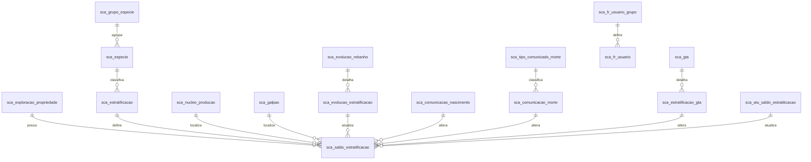

# Análise dos Arquivos SQL

## 1. Tabelas Identificadas

### Principais Tabelas
- **sca_saldo_estratificacao**
- **sca_evolucao_rebanho**
- **sca_evolucao_estratificacao**
- **sca_especie**
- **sca_grupo_especie**
- **sca_gta**
- **sca_estratificacao_gta**
- **sca_comunicacao_nascimento**
- **sca_comunicacao_morte**
- **sca_nucleo_producao**
- **sca_galpao**
- **sca_atu_saldo_estratiticacao**
- **sca_exploracao_propriedade**
- **sca_propriedade**
- **sca_tipo_comunicado_morte**
- **sca.fr_usuario_grupo**
- **sca.fr_usuario**

### Relacionamentos
- **sca_saldo_estratificacao** está relacionada a **sca_exploracao_propriedade**, **sca_estratificacao**, **sca_nucleo_producao**, **sca_galpao**.
- **sca_evolucao_rebanho** se conecta a **sca_evolucao_estratificacao**, **sca_especie**, **sca_exploracao_propriedade**.
- **sca_comunicacao_nascimento** e **sca_comunicacao_morte** usam **sca_especie**, **sca_estratificacao**, **sca_nucleo_producao**, **sca_galpao**.
- **sca_gta** e **sca_estratificacao_gta** se relacionam com **sca_exploracao_propriedade**, **sca_especie**, **sca_estratificacao**.

---

## 2. Consultas e Funções

### Principais Consultas
- **Saldo Atual, Evolução, Nascimentos, Entradas e Saídas**: Cálculo de saldos aptos, restritos e totais por faixa etária, espécie e propriedade.
- **Funções de Comunicação**: `fn_comunicacao_animais` e `fn_nascimento_obter_saldos_matriz` realizam validações, inserções e atualizações de saldos, nascimentos, mortes e evoluções.
- **Filtros por Carência**: Uso de carências do grupo de espécie para limitar evoluções e nascimentos.

### Resumo das Operações
- **Inserção/Atualização de Saldos**: Após eventos de nascimento, morte ou evolução.
- **Validação de Permissões**: Usuário gestor, unidade de atendimento.
- **Cancelamento/Exclusão**: Nascimentos, mortes e evoluções podem ser cancelados/excluídos com atualização dos saldos.

---

## 3. Diagrama Mermaid



---

## 4. Visualização das Consultas

### Exemplo de Consulta de Saldo Apto

```sql
SELECT
  p.exploracao_id,
  GREATEST(
    COALESCE(sa.saldo,0)
    - ( COALESCE(nc.qtd,0) + COALESCE(ev.qtd,0) + COALESCE(rc.qtd,0) ),
    0
  ) AS saldo_apto
FROM params p
LEFT JOIN saldo_atual sa ON ...
LEFT JOIN nascimentos_carencia nc ON ...
LEFT JOIN evoluido ev ON ...
LEFT JOIN recebido_carencia rc ON ...
```

### Função de Comunicação de Animais

- Valida permissões, insere/atualiza/cancela nascimentos, mortes e evoluções.
- Atualiza saldos conforme eventos.

---

## 5. Resumo Visual

- **Saldo**: Calculado por propriedade, espécie, faixa etária, núcleo, galpão e lote.
- **Eventos**: Nascimentos, mortes, evoluções e entradas/saídas de animais.
- **Carências**: Limitam operações conforme regras do grupo de espécie.
- **Permissões**: Usuário gestor e unidade de atendimento controlam ações.

---

# Conclusão
#
# Tabelas, Atributos e Relações

## 1. sca_saldo_estratificacao

| Atributo                 | Tipo         | Relação/Descrição                       |
|--------------------------|--------------|-----------------------------------------|
| saldo_estratificacao_id  | PK           | Identificador do saldo                  |
| exploracao_propriedade_id| FK           | Propriedade (sca_exploracao_propriedade)|
| estratificacao_id        | FK           | Faixa etária (sca_estratificacao)       |
| sld_saldo                | numeric/int  | Saldo                                   |
| nucleo_producao_id       | FK           | Núcleo (sca_nucleo_producao)            |
| galpao_id                | FK           | Galpão (sca_galpao)                     |
| sld_lote                 | varchar      | Lote                                    |
| sld_data_atualizacao     | timestamp    | Data de atualização                     |

## 2. sca_comunicacao_nascimento

| Atributo                 | Tipo         | Relação/Descrição                       |
|--------------------------|--------------|-----------------------------------------|
| comunicacao_nascimento_id| PK           | Identificador do nascimento             |
| exploracao_propriedade_id| FK           | Propriedade                             |
| produtor_id              | FK           | Produtor                                |
| unidade_local_id         | FK           | Unidade                                 |
| especie_id               | FK           | Espécie (sca_especie)                   |
| estratificacao_id        | FK           | Faixa etária                            |
| cna_quantidade           | int          | Quantidade nascida                      |
| usuario_digitacao_id     | FK           | Usuário                                 |
| cna_data_comunicacao     | date         | Data comunicação                        |
| cna_data_hora_comunicacao| timestamp    | Data/hora comunicação                   |
| nucleo_producao_id       | FK           | Núcleo                                  |
| galpao_id                | FK           | Galpão                                  |
| can_lote                 | varchar      | Lote                                    |
| situacao_comunicacao     | int          | Status                                  |
| motivo_cancelamento      | int          | Motivo cancelamento                     |
| data_cancelamento        | timestamp    | Data cancelamento                       |
| usuario_cancelamento_id  | FK           | Usuário cancelamento                    |

## 3. sca_comunicacao_morte

| Atributo                 | Tipo         | Relação/Descrição                       |
|--------------------------|--------------|-----------------------------------------|
| comunicacao_morte_id     | PK           | Identificador da morte                  |
| exploracao_propriedade_id| FK           | Propriedade                             |
| produtor_id              | FK           | Produtor                                |
| unidade_local_id         | FK           | Unidade                                 |
| especie_id               | FK           | Espécie                                 |
| estratificacao_id        | FK           | Faixa etária                            |
| cmo_quantidade           | int          | Quantidade morta                        |
| usuario_digitacao_id     | FK           | Usuário                                 |
| tipo_comunicado_morte_id | FK           | Tipo comunicado morte                   |
| cmo_data_comunicacao     | date         | Data comunicação                        |
| cmo_data_comunicacao_fim | date         | Data fim comunicação                    |
| cmo_data_hora_comunicacao| timestamp    | Data/hora comunicação                   |
| nucleo_producao_id       | FK           | Núcleo                                  |
| galpao_id                | FK           | Galpão                                  |
| cmo_lote                 | varchar      | Lote                                    |
| situacao_comunicacao     | int          | Status                                  |

## 4. sca_evolucao_rebanho

| Atributo                 | Tipo         | Relação/Descrição                       |
|--------------------------|--------------|-----------------------------------------|
| evolucao_rebanho_id      | PK           | Identificador da evolução               |
| exploracao_propriedade_id| FK           | Propriedade                             |
| produtor_id              | FK           | Produtor                                |
| unidade_local_id         | FK           | Unidade                                 |
| especie_id               | FK           | Espécie                                 |
| usuario_digitacao_id     | FK           | Usuário                                 |
| evr_data_evolucao        | date         | Data evolução                           |
| evr_hora_evolucao        | time         | Hora evolução                           |
| evr_data_hora_evolucao   | timestamp    | Data/hora evolução                      |

## 5. sca_evolucao_estratificacao

| Atributo                 | Tipo         | Relação/Descrição                       |
|--------------------------|--------------|-----------------------------------------|
| evolucao_estratificacao_id| PK           | Identificador da evolução estratificação |
| evolucao_rebanho_id      | FK           | Evolução rebanho                        |
| estratificacao_anterior_id| FK           | Faixa etária anterior                   |
| estratificacao_nova_id   | FK           | Faixa etária nova                       |
| ere_quantidade           | int          | Quantidade evoluída                     |
| ere_tipo_saldo           | char         | Tipo saldo                              |
| nucleo_producao_id       | FK           | Núcleo                                  |
| galpao_id                | FK           | Galpão                                  |
| ere_lote                 | varchar      | Lote                                    |

## 6. sca_gta

| Atributo                 | Tipo         | Relação/Descrição                       |
|--------------------------|--------------|-----------------------------------------|
| gta_id                   | PK           | Identificador GTA                       |
| gta_d_exploracao_id      | FK           | Destino exploração                      |
| gta_o_exploracao_id      | FK           | Origem exploração                       |
| grupo_especie_id         | FK           | Grupo espécie                           |
| situacao_gta_id          | char         | Situação                                |
| gta_data_chegada         | date         | Data chegada                            |
| gta_data_emissao         | date         | Data emissão                            |
| gta_d_estabelecimento_id | FK           | Destino estabelecimento                 |
| gta_o_estabelecimento_id | FK           | Origem estabelecimento                  |
| usuario_digitacao_entrada_id| FK        | Usuário entrada                         |

## 7. sca_estratificacao_gta

| Atributo                 | Tipo         | Relação/Descrição                       |
|--------------------------|--------------|-----------------------------------------|
| egt_id                   | PK           | Identificador                           |
| gta_id                   | FK           | GTA                                     |
| estratificacao_id        | FK           | Faixa etária                            |
| egt_qt_recebida          | int          | Qtde recebida                           |
| egt_qt_enviada           | int          | Qtde enviada                            |

## 8. sca_especie

| Atributo                 | Tipo         | Relação/Descrição                       |
|--------------------------|--------------|-----------------------------------------|
| especie_id               | PK           | Identificador espécie                   |
| grupo_especie_id         | FK           | Grupo espécie                           |
| esp_nome                 | varchar      | Nome espécie                            |

## 9. sca_grupo_especie

| Atributo                 | Tipo         | Relação/Descrição                       |
|--------------------------|--------------|-----------------------------------------|
| grupo_especie_id         | PK           | Identificador grupo espécie             |
| gre_carencia_evolucao    | int          | Carência evolução                       |
| gre_carencia_nascimento  | int          | Carência nascimento                     |
| gre_carencia_gta_matriz  | int          | Carência GTA matriz                     |
| gre_carencia_evolucao_matriz| int       | Carência evolução matriz                |

## 10. sca_nucleo_producao

| Atributo                 | Tipo         | Relação/Descrição                       |
|--------------------------|--------------|-----------------------------------------|
| nucleo_producao_id       | PK           | Identificador núcleo                    |
| npr_identificacao        | varchar      | Identificação                           |

## 11. sca_galpao

| Atributo                 | Tipo         | Relação/Descrição                       |
|--------------------------|--------------|-----------------------------------------|
| galpao_id                | PK           | Identificador galpão                    |
| glp_identificacao        | varchar      | Identificação                           |

## 12. sca_atu_saldo_estratiticacao

| Atributo                 | Tipo         | Relação/Descrição                       |
|--------------------------|--------------|-----------------------------------------|
| atu_saldo_estratiticacao_id| PK         | Identificador atualização saldo         |
| exploracao_propriedade_id| FK           | Propriedade                             |
| produtor_id              | FK           | Produtor                                |
| unidade_local_id         | FK           | Unidade                                 |
| especie_id               | FK           | Espécie                                 |
| estratificacao_id        | FK           | Faixa etária                            |
| ase_saldo_atual          | int          | Saldo atual                             |
| usuario_digitacao_id     | FK           | Usuário                                 |
| ase_data_digitacao       | date         | Data digitação                          |
| ase_data_hora_autorizacao| timestamp    | Data/hora autorização                   |
| nucleo_producao_id       | FK           | Núcleo                                  |
| galpao_id                | FK           | Galpão                                  |
| ase_lote                 | varchar      | Lote                                    |

## 13. sca_exploracao_propriedade

| Atributo                 | Tipo         | Relação/Descrição                       |
|--------------------------|--------------|-----------------------------------------|
| exploracao_propriedade_id| PK           | Identificador exploração                |
| propriedade_id           | FK           | Propriedade                             |
| unidade_local_id         | FK           | Unidade                                 |

## 14. sca_propriedade

| Atributo                 | Tipo         | Relação/Descrição                       |
|--------------------------|--------------|-----------------------------------------|
| propriedade_id           | PK           | Identificador propriedade               |
| unidade_local_id         | FK           | Unidade                                 |

## 15. sca_tipo_comunicado_morte

| Atributo                 | Tipo         | Relação/Descrição                       |
|--------------------------|--------------|-----------------------------------------|
| tipo_comunicado_morte_id | PK           | Identificador tipo comunicado morte      |
| tcm_nome                 | varchar      | Nome tipo comunicado                    |

## 16. sca.fr_usuario_grupo

| Atributo                 | Tipo         | Relação/Descrição                       |
|--------------------------|--------------|-----------------------------------------|
| usr_codigo               | PK           | Identificador usuário                   |
| grp_codigo               | FK           | Grupo                                   |

## 17. sca.fr_usuario

| Atributo                 | Tipo         | Relação/Descrição                       |
|--------------------------|--------------|-----------------------------------------|
| usr_codigo               | PK           | Identificador usuário                   |
| usr_login                | varchar      | Login                                   |

#
# Diagrama Visual das Relações


Este schema representa um sistema robusto de controle de rebanho, com rastreamento detalhado de saldos, eventos e permissões. O diagrama Mermaid acima ilustra as principais relações entre tabelas, facilitando a compreensão do fluxo de dados e operações.

---
