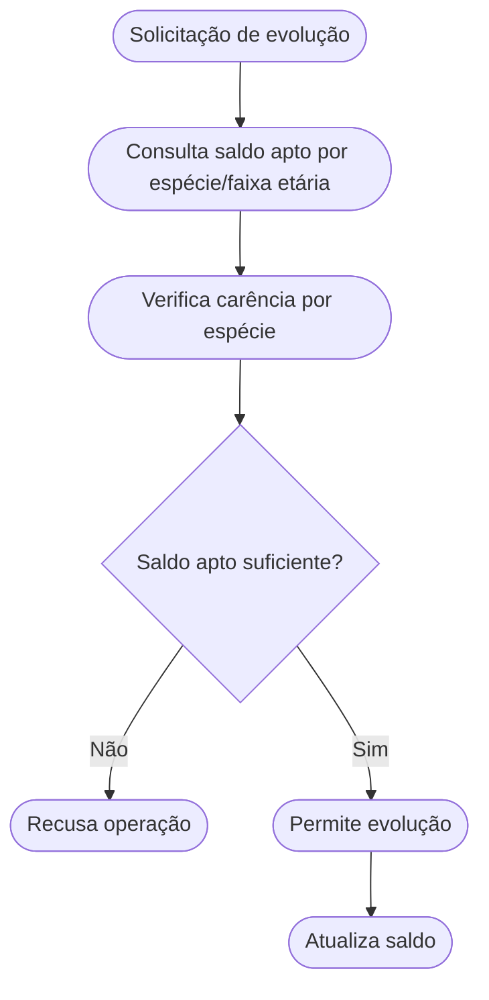
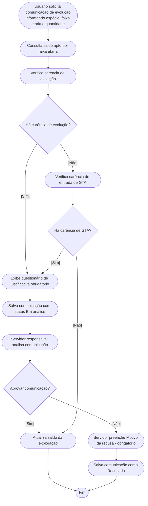
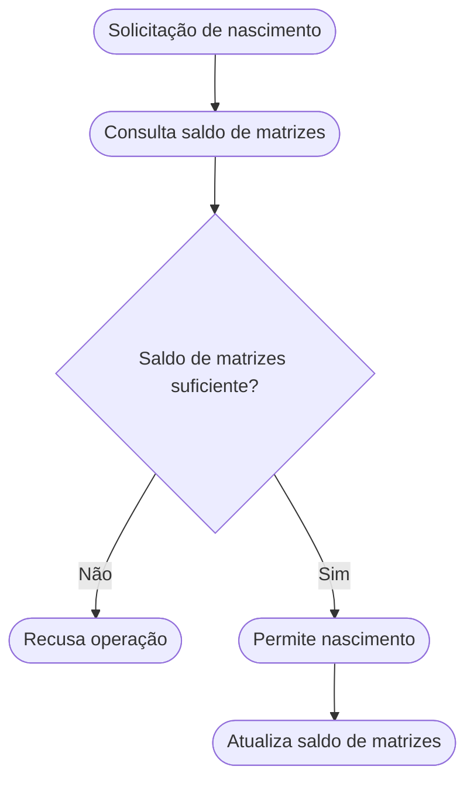
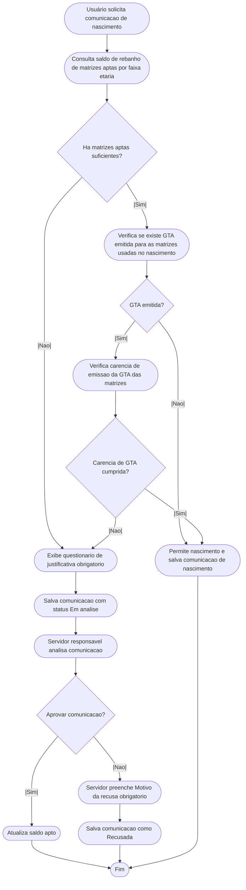

# Regra de negócio detalhada da funcionalidade de Carência de Comunicações
Este documento apresenta uma análise detalhada dos processos de negócio relacionados à carência de comunicações, comparando o cenário atual ("ANTES") com o cenário desejável ("DEPOIS"), conforme os requisitos do documento "Travas no procedimento de evolução e nascimento". Os processos abordados incluem a Comunicação de Nascimento e a Comunicação de Evolução de Rebanho.

---

## 1. Evolução de Rebanho

### Cenário Atual (ANTES)
1. O usuário solicita a evolução de animais.
2. O sistema consulta o saldo apto por espécie/faixa etária.
3. A verificação de carência é realizada apenas por espécie, sem considerar a faixa etária.
4. Havendo saldo apto suficiente, a evolução é permitida e o saldo é atualizado.
5. Campos de saldo temporário/parcial podem ser exibidos.
6. Não há controle detalhado das datas de chegada ou evolução dos animais.

**Fluxo Simplificado:**
- Solicitação → Consulta saldo → Verificação de carência → Permissão/Recusa → Atualização de saldo

---

### Cenário Desejável (DEPOIS)
1. O usuário solicita a evolução de animais, informando espécie, faixa etária e quantidade.
2. O sistema consulta o saldo apto considerando espécie, faixa etária e datas de chegada/evolução.
3. A carência é verificada especificamente por faixa etária, considerando o prazo definido.
4. Para cada grupo de animais, o sistema verifica:
   - Se data de chegada + carência ≤ data atual.
   - Se data da última evolução + carência ≤ data atual.
   - Se existe GTA emitida para a mesma faixa etária, verificar se a carência de emissão da GTA também foi cumprida. Se não, encaminha para questionário e salva como "em análise".
5. Havendo saldo apto suficiente e carências cumpridas, a evolução é permitida e o saldo é atualizado.
6. Caso contrário, é exibido automaticamente um questionário de justificativa, obrigatório para prosseguir.
7. A comunicação é registrada com status "Em análise", aguardando aprovação de um servidor responsável.
8. Se aprovada, a comunicação é efetivada e os saldos são atualizados. O campo "Motivo da recusa" permanece em branco.
9. Se recusada, a comunicação é recusada e o usuário pode registrar uma nova solicitação. O servidor deve preencher obrigatoriamente o campo "Motivo da recusa".
10. Os campos de saldo temporário/parcial são removidos da interface.

**Fluxo de Comunicação de Evolução Detalhado:**
1. Usuário solicita a comunicação de evolução, informando espécie, faixa etária e quantidade.
2. O sistema consulta o saldo de rebanho apto para a faixa etária específica.
3. O sistema verifica se há carência de evolução para a faixa etária informada:
    - **Se houver carência:** 
      - Exibe questionário de justificativa obrigatório.
      - Salva a comunicação com status "Em análise".
      - Servidor responsável analisa a comunicação.
      - Se aprovada, atualiza o saldo apto.
      - Se recusada, o servidor deve obrigatoriamente preencher o campo "Motivo da recusa".
    - **Se não houver carência:** 
      - Verifica se há carência de emissão de GTA para a mesma faixa etária.
         - **Se houver carência de GTA:**
            - Exibe questionário de justificativa obrigatório.
            - Salva a comunicação com status "Em análise".
            - Servidor responsável analisa a comunicação.
            - Se aprovada, atualiza o saldo apto.
            - Se recusada, o servidor deve obrigatoriamente preencher o campo "Motivo da recusa".
         - **Se não houver carência de GTA:**
            - Permite a evolução e atualiza o saldo apto imediatamente.

---

## 2. Nascimento

### Cenário Atual (ANTES)
1. O usuário solicita o registro de nascimento.
2. O sistema consulta o saldo de matrizes (fêmeas ≥ 13-24 meses).
3. O nascimento é permitido até o limite do saldo de matrizes.
4. A carência é genérica, não vinculada à data de chegada/evolução.

**Fluxo Simplificado:**
- Solicitação → Consulta matrizes → Permissão/Recusa → Atualização de saldo

---

### Cenário Desejável (DEPOIS)
1. O usuário solicita o registro de nascimento, informando espécie, faixa etária e quantidade.
2. O sistema consulta matrizes aptas, considerando carência específica por faixa etária.
3. Para cada matriz, verifica se data de chegada + carência ≤ data atual.
4. Verifica se existe GTA emitida para a mesma faixa etária. Se houver, verifica se a carência de emissão da GTA foi cumprida. Se não, encaminha para questionário e salva como "em análise".
5. O nascimento é permitido apenas se a quantidade solicitada for menor ou igual ao número de matrizes aptas e todas as carências cumpridas.
6. Caso contrário, é exibido automaticamente um questionário de justificativa, obrigatório para prosseguir.
7. A comunicação é registrada com status "Em análise", aguardando aprovação de um servidor responsável.
8. Se aprovada, a comunicação é efetivada e os saldos são atualizados. O campo "Motivo da recusa" permanece em branco.
9. Se recusada, a comunicação é recusada e o usuário pode registrar uma nova solicitação. O servidor deve preencher obrigatoriamente o campo "Motivo da recusa".
10. O saldo de matrizes aptas é atualizado após o nascimento.

**Fluxo de Comunicação de Nascimento Detalhado:**
1. Usuário solicita a comunicação de nascimento.
2. O sistema consulta o saldo de rebanho de matrizes aptas, ou seja, na faixa etária específica.
3. Há matrizes aptas suficientes para o nascimento solicitado?
    - **Se não houver matrizes aptas suficientes:**
      - Leva ao questionário de justificativa obrigatório.
      - Salva a comunicação com status "Em análise".
      - Servidor responsável analisa a comunicação.
        - Se aprovada, atualiza o saldo apto.
        - Se recusada, o servidor deve obrigatoriamente preencher o campo "Motivo da recusa".
      - Encerra o processo.
    - **Se houver matrizes aptas suficientes:**
      - Verifica se há GTA emitida para as matrizes usadas no nascimento.
         - **Se não houver GTA emitida:**
           - Permite o nascimento.
           - Salva a comunicação de nascimento.
           - Finaliza o processo.
         - **Se houver GTA emitida:**
           - Verifica se a carência de emissão da GTA das matrizes foi cumprida.
              - **Se a carência não foi cumprida:**
                - Leva ao questionário de justificativa obrigatório.
                - Salva a comunicação com status "Em análise".
                - Servidor responsável analisa a comunicação.
                  - Se aprovada, atualiza o saldo apto.
                  - Se recusada, o servidor deve obrigatoriamente preencher o campo "Motivo da recusa".
                - Finaliza o processo.
              - **Se a carência foi cumprida:**
                - Permite o nascimento.
                - Salva a comunicação de nascimento.
                - Atualiza o saldo de matrizes aptas.
                - Finaliza o processo.
                

---

# Observações Gerais

- Todas as regras de carência devem ser aplicadas considerando espécie, faixa etária e quantidade.
- O sistema deve registrar e consultar datas de chegada, evolução e nascimento para garantir precisão no cálculo do saldo apto.
- Mensagens de bloqueio devem ser claras e orientativas, promovendo transparência ao usuário.
- O processo de comunicação em análise garante maior controle e rastreabilidade das exceções, fortalecendo a governança dos procedimentos.
- O campo "Motivo da recusa" é obrigatório sempre que houver recusa de comunicação em análise.

---
