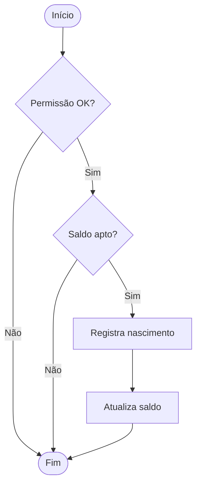
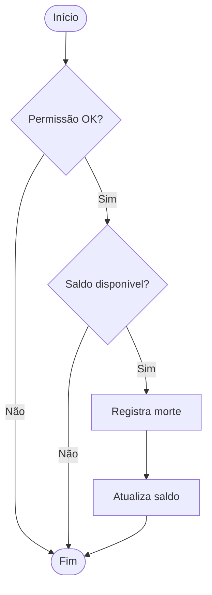
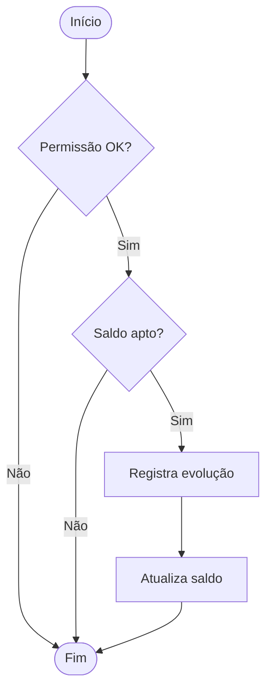
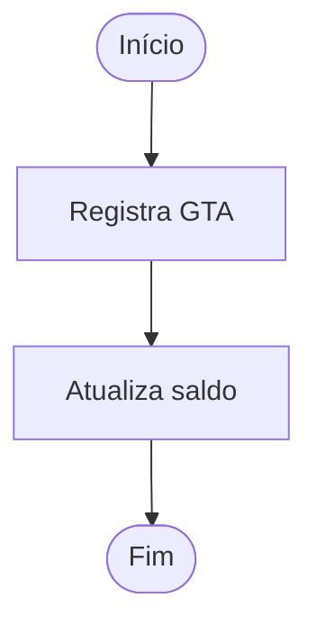
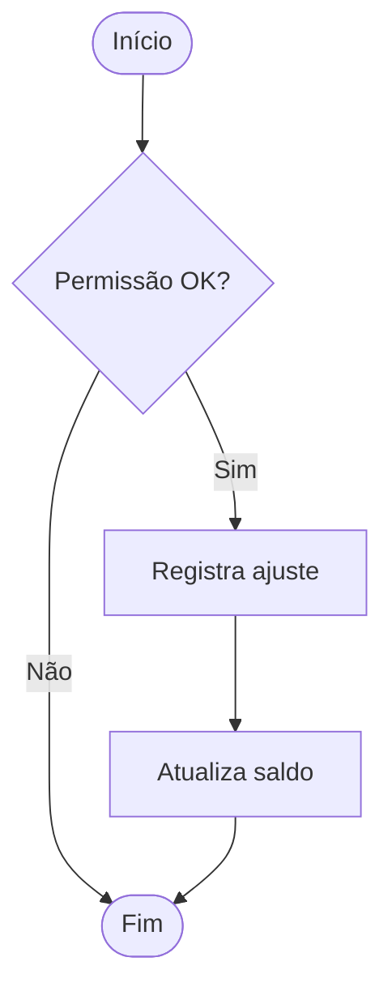

# Processos de Negócio: Controle de Rebanho

Este documento detalha os principais processos de negócio mapeados a partir da análise do schema SQL, com fluxos, regras e detalhes operacionais. Cada processo é acompanhado de um diagrama visual em Mermaid para facilitar o entendimento.

---

## 1. Comunicação de Nascimento

### Descrição
Processo para registrar o nascimento de animais em uma propriedade, validando permissões, saldo de matrizes e atualizando os saldos.

### Fluxo
1. Usuário solicita comunicação de nascimento.
2. Sistema valida permissões (unidade, gestor).
3. Verifica saldo apto de matrizes (faixa etária, espécie, núcleo, galpão, lote).
4. Se saldo suficiente, insere registro em `sca_comunicacao_nascimento`.
5. Atualiza saldo em `sca_saldo_estratificacao`.
6. Permite cancelamento, com atualização reversa do saldo.

---

## 2. Comunicação de Morte

### Descrição
Processo para registrar a morte de animais, validando permissões e saldo, e atualizando os saldos.

### Fluxo
1. Usuário solicita comunicação de morte.
2. Sistema valida permissões (unidade, gestor).
3. Verifica saldo disponível na faixa etária.
4. Se saldo suficiente, insere registro em `sca_comunicacao_morte`.
5. Atualiza saldo em `sca_saldo_estratificacao`.
6. Permite exclusão, com atualização reversa do saldo.

---

## 3. Evolução de Rebanho

### Descrição
Processo para evoluir animais entre faixas etárias, validando permissões, saldo apto e carências do grupo de espécie.

### Fluxo
1. Usuário solicita evolução de rebanho.
2. Sistema valida permissões.
3. Verifica saldo apto para evolução (considerando carências).
4. Se saldo suficiente, insere registro em `sca_evolucao_rebanho` e `sca_evolucao_estratificacao`.
5. Atualiza saldo nas faixas etárias envolvidas.
6. Permite exclusão, com atualização reversa dos saldos.

---

## 4. Entrada e Saída de Animais (GTA)

### Descrição
Processo para registrar entradas e saídas de animais via GTA, atualizando saldos e respeitando carências e faixas etárias.

### Fluxo
1. Usuário registra GTA de entrada ou saída.
2. Sistema valida permissões e dados.
3. Atualiza saldos em `sca_saldo_estratificacao` conforme faixas e carências.
4. Relaciona registros em `sca_gta` e `sca_estratificacao_gta`.

---

## 5. Atualização Manual de Saldos

### Descrição
Processo para ajuste manual de saldos por usuário autorizado, via `sca_atu_saldo_estratiticacao`.

### Fluxo
1. Usuário solicita ajuste.
2. Sistema valida permissões.
3. Insere registro de ajuste.
4. Atualiza saldo em `sca_saldo_estratificacao`.

---

# Observações Gerais
- Todos os processos dependem de validação de permissões e regras de negócio específicas (carências, faixas, espécie, núcleo, galpão, lote).
- Cancelamentos e exclusões sempre atualizam os saldos de forma reversa.
- O controle é centralizado em saldos por faixa etária, espécie e localização.

---
