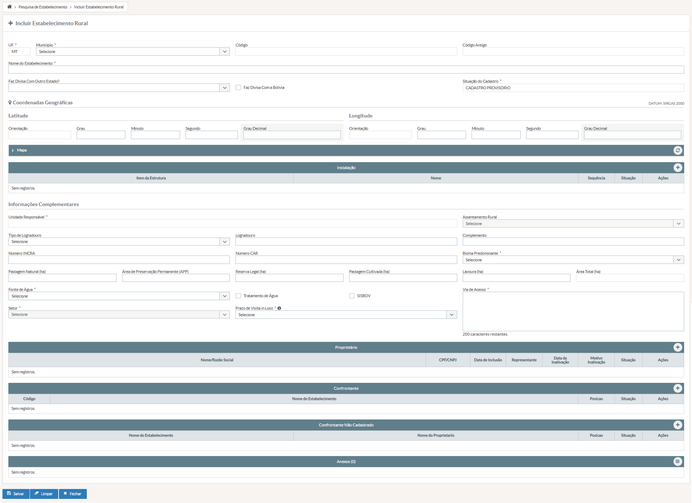

# US003 - Incluir Estabelecimento Rural

## DESCRIÇÃO

**Título da Tela:** + Incluir Estabelecimento Rural
**Caminho de navegação (breadcrumb):** Pesquisa de Estabelecimento > Incluir Estabelecimento Rural

**EU COMO** servidor do INDEA 
**QUERO** registrar e gerenciar todas as informações cadastrais completas de um estabelecimento rural
**PARA QUE** eu possa manter o cadastro de propriedades rurais atualizado para controle sanitário animal, garantindo a rastreabilidade e conformidade com as normas regulamentares.

---

## PROTÓTIPO DE TELA

*Figura 1: Tela de inclusão de estabelecimento rural com identificação, localização, dados do proprietário e informações complementares*

---

## 1. Critérios de Aceitação - Campos

### a) Identificação e Localização

#### **Campo: UF**
- **Título**: UF (Unidade Federativa)
- **Tipo do Campo**: Texto
- **Estado Inicial**: Valor fixo "MT" já preenchido
- **Preenchimento do Campo**: Apenas visualização
- **Visibilidade**: Sempre visível
- **Valor de Preenchimento Automático**: Valor fixo "MT" (Mato Grosso)
- **Lista de Valores Permitidos**: Apenas "MT"
- **Validações Extras**: Campo não editável, sempre MT

#### **Campo: Município**
- **Título**: Município
- **Tipo do Campo**: Seleção Única (Dropdown)
- **Opções**: Lista de municípios do estado de MT (tabela: municipios_mt)
- **Seleção**: Uma opção obrigatória
- **Estado Inicial**: Placeholder "Selecione o município"
- **Preenchimento do Campo**: Obrigatório
- **Visibilidade**: Sempre visível
- **Valor Único**: Não (pode haver vários estabelecimentos no mesmo município)
- **Validações Extras**: Deve ser um município válido de MT

#### **Campo: Código**
- **Título**: Código do Estabelecimento
- **Tipo do Campo**: Texto
- **Estado Inicial**: Vazio
- **Preenchimento do Campo**: Apenas visualização
- **Visibilidade**: Visível apenas após salvamento
- **Tamanho Máximo**: 20 caracteres
- **Valor Único**: Sim (código único por estabelecimento)
- **Valor de Preenchimento Automático**: Gerado automaticamente pelo sistema após primeira gravação
- **Validação de Formato**: Alfanumérico sequencial

#### **Campo: Código Antigo**
- **Título**: Código Antigo
- **Tipo do Campo**: Texto
- **Estado Inicial**: Vazio
- **Preenchimento do Campo**: Apenas visualização
- **Visibilidade**: Visível apenas se existir código anterior no sistema
- **Tamanho Máximo**: 20 caracteres
- **Valor de Preenchimento Automático**: Recuperado de sistemas anteriores, se existir

#### **Campo: Nome do Estabelecimento**
- **Título**: Nome do Estabelecimento
- **Tipo do Campo**: Texto
- **Estado Inicial**: Vazio com placeholder "Digite o nome do estabelecimento"
- **Preenchimento do Campo**: Obrigatório
- **Visibilidade**: Sempre visível
- **Tamanho Mínimo**: 3 caracteres
- **Tamanho Máximo**: 100 caracteres
- **Valor Único**: Sim (dentro do mesmo município)
- **Validações Extras**: Não pode conter apenas números ou caracteres especiais

#### **Campo: Situação do Cadastro**
- **Título**: Situação do Cadastro
- **Tipo do Campo**: Texto
- **Estado Inicial**: "CADASTRO PROVISÓRIO"
- **Preenchimento do Campo**: Apenas visualização
- **Visibilidade**: Sempre visível
- **Lista de Valores Permitidos**: "CADASTRO PROVISÓRIO", "CADASTRO DEFINITIVO", "INATIVO"
- **Valor de Preenchimento Automático**: Inicia como "CADASTRO PROVISÓRIO", atualizado conforme regras de validação

#### **Campo: Faz Divisa Com Outro Estado?**
- **Título**: Faz Divisa Com Outro Estado?
- **Tipo do Campo**: Seleção Múltipla (Checkbox)
- **Opções**: Lista de estados brasileiros (tabela: estados)
- **Seleção**: Múltiplas opções permitidas
- **Estado Inicial**: Nenhuma opção selecionada
- **Preenchimento do Campo**: Opcional
- **Visibilidade**: Sempre visível
- **Validações Extras**: Não pode selecionar o próprio MT

#### **Campo: Faz Divisa Com a Bolívia**
- **Título**: Faz Divisa Com a Bolívia
- **Tipo do Campo**: Booleano (Checkbox)
- **Opções**: Sim/Não
- **Seleção**: Uma opção (marcado/desmarcado)
- **Estado Inicial**: Desmarcado
- **Preenchimento do Campo**: Opcional
- **Visibilidade**: Sempre visível

### b) Coordenadas Geográficas

#### **Campo: Orientação (Latitude)**
- **Título**: Orientação da Latitude
- **Tipo do Campo**: Seleção Única (Dropdown)
- **Opções**: N - Norte, S - Sul
- **Seleção**: Uma opção obrigatória
- **Estado Inicial**: "S - Sul" pré-selecionado (padrão para MT)
- **Preenchimento do Campo**: Obrigatório
- **Visibilidade**: Sempre visível
- **Lista de Valores Permitidos**: "N", "S"

#### **Campo: Grau (Latitude)**
- **Título**: Grau da Latitude
- **Tipo do Campo**: Número Inteiro
- **Estado Inicial**: Vazio com placeholder "Ex: 15"
- **Preenchimento do Campo**: Obrigatório
- **Visibilidade**: Sempre visível
- **Valor Mínimo**: 7 (limite sul de MT)
- **Valor Máximo**: 18 (limite norte de MT)
- **Validações Extras**: Deve estar dentro dos limites geográficos de MT

#### **Campo: Minuto (Latitude)**
- **Título**: Minuto da Latitude
- **Tipo do Campo**: Número Inteiro
- **Estado Inicial**: Vazio com placeholder "Ex: 30"
- **Preenchimento do Campo**: Obrigatório
- **Visibilidade**: Sempre visível
- **Valor Mínimo**: 0
- **Valor Máximo**: 59

#### **Campo: Segundo (Latitude)**
- **Título**: Segundo da Latitude
- **Tipo do Campo**: Número Decimal
- **Estado Inicial**: Vazio com placeholder "Ex: 45.123"
- **Preenchimento do Campo**: Obrigatório
- **Visibilidade**: Sempre visível
- **Valor Mínimo**: 0
- **Valor Máximo**: 59.999
- **Validação de Formato**: Até 3 casas decimais

#### **Campo: Orientação (Longitude)**
- **Título**: Orientação da Longitude
- **Tipo do Campo**: Seleção Única (Dropdown)
- **Opções**: L - Leste, W - Oeste
- **Seleção**: Uma opção obrigatória
- **Estado Inicial**: "W - Oeste" pré-selecionado (padrão para MT)
- **Preenchimento do Campo**: Obrigatório
- **Visibilidade**: Sempre visível
- **Lista de Valores Permitidos**: "L", "W"

#### **Campo: Grau (Longitude)**
- **Título**: Grau da Longitude
- **Tipo do Campo**: Número Inteiro
- **Estado Inicial**: Vazio com placeholder "Ex: 56"
- **Preenchimento do Campo**: Obrigatório
- **Visibilidade**: Sempre visível
- **Valor Mínimo**: 50 (limite leste de MT)
- **Valor Máximo**: 65 (limite oeste de MT)
- **Validações Extras**: Deve estar dentro dos limites geográficos de MT

#### **Campo: Minuto (Longitude)**
- **Título**: Minuto da Longitude
- **Tipo do Campo**: Número Inteiro
- **Estado Inicial**: Vazio com placeholder "Ex: 30"
- **Preenchimento do Campo**: Obrigatório
- **Visibilidade**: Sempre visível
- **Valor Mínimo**: 0
- **Valor Máximo**: 59

#### **Campo: Segundo (Longitude)**
- **Título**: Segundo da Longitude
- **Tipo do Campo**: Número Decimal
- **Estado Inicial**: Vazio com placeholder "Ex: 45.123"
- **Preenchimento do Campo**: Obrigatório
- **Visibilidade**: Sempre visível
- **Valor Mínimo**: 0
- **Valor Máximo**: 59.999
- **Validação de Formato**: Até 3 casas decimais

#### **Campo: Georreferenciada?**
- **Título**: Coordenadas Georreferenciadas?
- **Tipo do Campo**: Booleano (Checkbox)
- **Estado Inicial**: Desmarcado
- **Preenchimento do Campo**: Opcional
- **Visibilidade**: Sempre visível

#### **Campo: Tipo de Georreferenciamento**
- **Título**: Tipo de Georreferenciamento
- **Tipo do Campo**: Seleção Única (Dropdown)
- **Opções**: GPS, Topografia, Cartografia, Outro (tabela: tipos_georreferenciamento)
- **Seleção**: Uma opção
- **Estado Inicial**: Desabilitado com placeholder "Selecione o tipo"
- **Preenchimento do Campo**: Condicionado (obrigatório apenas se "Georreferenciada?" estiver marcado)
- **Visibilidade**: Visível apenas quando "Georreferenciada?" estiver marcado

#### **Campo: Latitude (Decimal)**
- **Título**: Latitude (Decimal)
- **Tipo do Campo**: Número Decimal
- **Estado Inicial**: Vazio
- **Preenchimento do Campo**: Apenas visualização
- **Visibilidade**: Visível após preenchimento dos campos de Grau, Minuto e Segundo da Latitude
- **Valor de Preenchimento Automático**: Calculado automaticamente pela fórmula: Grau + (Minuto/60) + (Segundo/3600)
- **Validação de Formato**: Até 6 casas decimais

#### **Campo: Longitude (Decimal)**
- **Título**: Longitude (Decimal)
- **Tipo do Campo**: Número Decimal
- **Estado Inicial**: Vazio
- **Preenchimento do Campo**: Apenas visualização
- **Visibilidade**: Visível após preenchimento dos campos de Grau, Minuto e Segundo da Longitude
- **Valor de Preenchimento Automático**: Calculado automaticamente pela fórmula: Grau + (Minuto/60) + (Segundo/3600)
- **Validação de Formato**: Até 6 casas decimais

### c) Tabela Proprietário

#### **Elemento: Tabela de Proprietários**
- **Título**: Proprietários do Estabelecimento
- **Tipo do Campo**: Tabela de Dados (DataTable)
- **Estado Inicial**: Tabela vazia
- **Preenchimento do Campo**: Obrigatório (pelo menos 1 proprietário)
- **Visibilidade**: Sempre visível
- **Validações Extras**: Deve conter pelo menos um proprietário para permitir salvamento

#### **Coluna: CPF/CNPJ**
- **Título**: CPF/CNPJ
- **Tipo do Campo**: Texto
- **Preenchimento do Campo**: Apenas visualização
- **Visibilidade**: Sempre visível na tabela
- **Tamanho Máximo**: 18 caracteres (CNPJ formatado)
- **Validação de Formato**: CPF (000.000.000-00) ou CNPJ (00.000.000/0000-00)
- **Valor de Preenchimento Automático**: Formatação automática com máscara
- **Valor Único**: Sim (não pode haver proprietários duplicados)

#### **Coluna: Nome/Razão Social**
- **Título**: Nome/Razão Social
- **Tipo do Campo**: Texto
- **Preenchimento do Campo**: Apenas visualização
- **Visibilidade**: Sempre visível na tabela
- **Tamanho Máximo**: 100 caracteres
- **Valor de Preenchimento Automático**: Recuperado do cadastro de pessoa (física/jurídica)

#### **Botão: Adicionar Proprietário**
- **Título**: Adicionar Proprietário
- **Tipo do Campo**: Botão de Ação
- **Estado Inicial**: Habilitado
- **Visibilidade**: Sempre visível
- **Validações Extras**: Abre modal de busca/cadastro de proprietário
- **Classificação da Ação:** Ação Apenas em Tela
- **Ação realizada:** Abre modal para busca e seleção/cadastro de proprietário
- **Destino da navegação:** Modal de "Buscar/Cadastrar Proprietário"
- **Validações:** Busca por CPF/CNPJ ou nome; Verifica se proprietário já não está vinculado ao estabelecimento; Permite cadastro novo se não encontrado; Atualiza tabela após seleção

#### **Botão: Editar Proprietário**
- **Título**: Editar
- **Tipo do Campo**: Botão de Ação (Ícone)
- **Estado Inicial**: Habilitado por linha
- **Visibilidade**: Visível em cada linha da tabela
- **Validações Extras**: Permite alteração dos dados do proprietário selecionado
- **Classificação da Ação:** Ação Apenas em Tela
- **Ação realizada:** Abre modal de edição dos dados do proprietário
- **Destino da navegação:** Modal de "Editar Dados do Proprietário"
- **Validações:** Carrega dados atuais do proprietário; Permite alteração de CPF/CNPJ e nome; Verifica duplicidade; Atualiza dados na tabela após confirmação

#### **Botão: Remover Proprietário**
- **Título**: Remover
- **Tipo do Campo**: Botão de Ação (Ícone)
- **Estado Inicial**: Habilitado por linha
- **Visibilidade**: Visível em cada linha da tabela
- **Validações Extras**: Não permite remoção se for o único proprietário; requer confirmação
- **Classificação da Ação:** Ações Práticas
- **Ação realizada:** Remove proprietário da lista do estabelecimento
- **Destino da navegação:** Permanece na tela atual (atualiza tabela)
- **Validações:** Verifica se não é o único proprietário (mínimo 1 obrigatório); Solicita confirmação: "Deseja remover este proprietário?"; Remove apenas vinculação, não exclui dados do proprietário do sistema; Atualiza contadores na interface

### d) Tabela Confrontante

#### **Elemento: Tabela de Confrontantes**
- **Título**: Estabelecimentos Confrontantes
- **Tipo do Campo**: Tabela de Dados (DataTable)
- **Estado Inicial**: Tabela vazia
- **Preenchimento do Campo**: Opcional
- **Visibilidade**: Sempre visível

#### **Coluna: Nome do Confrontante**
- **Título**: Nome do Estabelecimento/Propriedade
- **Tipo do Campo**: Texto
- **Preenchimento do Campo**: Obrigatório (ao adicionar)
- **Visibilidade**: Sempre visível na tabela
- **Tamanho Mínimo**: 3 caracteres
- **Tamanho Máximo**: 100 caracteres
- **Validações Extras**: Não pode ser igual ao nome do estabelecimento atual

#### **Coluna: Distância (metros)**
- **Título**: Distância (m)
- **Tipo do Campo**: Número Inteiro
- **Preenchimento do Campo**: Obrigatório (ao adicionar)
- **Visibilidade**: Sempre visível na tabela
- **Valor Mínimo**: 1
- **Valor Máximo**: 999999
- **Validação de Formato**: Formatação numérica com separador de milhar

#### **Botão: Adicionar Confrontante**
- **Título**: Adicionar Confrontante
- **Tipo do Campo**: Botão de Ação
- **Estado Inicial**: Habilitado
- **Visibilidade**: Sempre visível
- **Validações Extras**: Abre modal para inserção de nome e distância
- **Classificação da Ação:** Ação Apenas em Tela
- **Ação realizada:** Abre modal para cadastro de estabelecimento confrontante
- **Destino da navegação:** Modal de "Adicionar Confrontante"
- **Validações:** Nome deve ter 3-100 caracteres; Não pode ser igual ao nome do estabelecimento atual; Distância deve ser 1-999999 metros; Verifica duplicidade de nome; Adiciona à tabela após confirmação

#### **Botão: Editar Confrontante**
- **Título**: Editar
- **Tipo do Campo**: Botão de Ação (Ícone)
- **Estado Inicial**: Habilitado por linha
- **Visibilidade**: Visível em cada linha da tabela
- **Validações Extras**: Permite alteração dos dados do confrontante selecionado
- **Classificação da Ação:** Ação Apenas em Tela
- **Ação realizada:** Abre modal de edição dos dados do confrontante
- **Destino da navegação:** Modal de "Editar Confrontante"
- **Validações:** Carrega nome e distância atuais; Aplica mesmas validações do cadastro; Verifica duplicidade com outros confrontantes; Atualiza dados na tabela após confirmação

#### **Botão: Remover Confrontante**
- **Título**: Remover
- **Tipo do Campo**: Botão de Ação (Ícone)
- **Estado Inicial**: Habilitado por linha
- **Visibilidade**: Visível em cada linha da tabela
- **Validações Extras**: Requer confirmação; sem restrição de quantidade mínima
- **Classificação da Ação:** Ações Práticas
- **Ação realizada:** Remove confrontante da lista do estabelecimento
- **Destino da navegação:** Permanece na tela atual (atualiza tabela)
- **Validações:** Solicita confirmação: "Deseja remover este confrontante?"; Sem quantidade mínima obrigatória; Remove registro da lista; Atualiza contadores na interface

### e) Tabela Anexos

#### **Elemento: Tabela de Anexos**
- **Título**: Documentos Anexados
- **Tipo do Campo**: Tabela de Dados (DataTable)
- **Estado Inicial**: Tabela vazia
- **Preenchimento do Campo**: Opcional
- **Visibilidade**: Sempre visível

#### **Coluna: Nome do Arquivo**
- **Título**: Nome do Arquivo
- **Tipo do Campo**: Texto (Link)
- **Preenchimento do Campo**: Apenas visualização
- **Visibilidade**: Sempre visível na tabela
- **Tamanho Máximo**: 255 caracteres
- **Valor de Preenchimento Automático**: Nome original do arquivo enviado
- **Validações Extras**: Link clicável para download do arquivo

#### **Coluna: Data do Anexo**
- **Título**: Data de Upload
- **Tipo do Campo**: Data/Hora
- **Preenchimento do Campo**: Apenas visualização
- **Visibilidade**: Sempre visível na tabela
- **Validação de Formato**: dd/mm/aaaa hh:mm
- **Valor de Preenchimento Automático**: Data e hora atual no momento do upload

#### **Botão: Adicionar Anexo**
- **Título**: Adicionar Arquivo
- **Tipo do Campo**: Botão de Upload de Arquivo
- **Estado Inicial**: Habilitado
- **Visibilidade**: Sempre visível
- **Lista de Valores Permitidos**: PDF, JPG, JPEG, PNG, DOC, DOCX
- **Validações Extras**: Tamanho máximo 5MB por arquivo; máximo 10 arquivos por estabelecimento
- **Classificação da Ação:** Ações Práticas
- **Ação realizada:** Abre dialog de seleção de arquivo para upload
- **Destino da navegação:** Permanece na tela atual (adiciona arquivo à tabela)
- **Validações:** Verifica extensão permitida (PDF, JPG, JPEG, PNG, DOC, DOCX); Tamanho máximo 5MB por arquivo; Máximo 10 arquivos por estabelecimento; Não permite arquivos duplicados (mesmo nome); Adiciona à tabela com data/hora atual; Upload para servidor temporário até salvamento

#### **Botão: Download**
- **Título**: Download
- **Tipo do Campo**: Botão de Ação (Ícone)
- **Estado Inicial**: Habilitado por linha
- **Visibilidade**: Visível em cada linha da tabela
- **Validações Extras**: Inicia download do arquivo selecionado
- **Classificação da Ação:** Link
- **Ação realizada:** Realiza download do arquivo anexado
- **Destino da navegação:** Abre dialog de download do navegador
- **Validações:** Verifica se arquivo existe no servidor; Registra log de acesso ao arquivo; Mantém nome original do arquivo; Força download (não abre no navegador)

#### **Botão: Excluir Anexo**
- **Título**: Excluir
- **Tipo do Campo**: Botão de Ação (Ícone)
- **Estado Inicial**: Habilitado por linha
- **Visibilidade**: Visível em cada linha da tabela
- **Validações Extras**: Requer confirmação; operação irreversível; remove arquivo do servidor
- **Classificação da Ação:** Ações Práticas
- **Ação realizada:** Remove arquivo da lista e do servidor
- **Destino da navegação:** Permanece na tela atual (atualiza tabela)
- **Validações:** Solicita confirmação: "Deseja excluir este arquivo? Esta ação não pode ser desfeita."; Remove arquivo físico do servidor; Remove registro da tabela; Atualiza contadores de arquivos; Registra log de exclusão para auditoria

## 2. Regras / Validações / AÇÕES não relacionadas apenas a um campo

* **Validação de Coordenadas:** Ao salvar, o sistema deve garantir que as coordenadas (Latitude e Longitude em decimal) estejam dentro dos limites geográficos do estado de Mato Grosso (MT).
* **Nome do Estabelecimento:** Deve ser único no município ou estado (regra a ser confirmada).
* **Proprietário Obrigatório:** O estabelecimento deve ter **pelo menos um** proprietário cadastrado para que o salvamento seja concluído.

## 3. Botões de Ação Principais

### **Botão: Salvar**
- **Título**: Salvar
- **Tipo do Campo**: Botão de Ação Principal
- **Estado Inicial**: Habilitado
- **Preenchimento do Campo**: Ação de sistema
- **Visibilidade**: Sempre visível
- **Validações Extras**: 
  - Executa validação completa de todos os campos obrigatórios
  - Verifica se há pelo menos um proprietário cadastrado
  - Valida coordenadas geográficas dentro dos limites de MT
  - Verifica unicidade do nome do estabelecimento no município
  - Exibe mensagens de erro específicas se validações falharem
  - Após sucesso, exibe mensagem de confirmação e gera código do estabelecimento
- **Regras de Negócio**: 
  - Desabilitado durante processamento
  - Grava dados no banco
  - Atualiza situação do cadastro
  - Gera log de auditoria
- **Classificação da Ação:** Ações Práticas
- **Ação realizada:** Processa e grava o estabelecimento rural no sistema
- **Destino da navegação:** Permanece na tela atual com mensagem de sucesso ou retorna para listagem
- **Validações:** Executa TODAS as validações obrigatórias de campos; Verifica pelo menos 1 proprietário cadastrado; Valida coordenadas dentro dos limites geográficos de MT; Confirma unicidade do nome no município; Processa upload definitivo de anexos; Gera código automático do estabelecimento; Atualiza situação para "CADASTRO PROVISÓRIO"; Registra log completo de auditoria; Move arquivos temporários para local definitivo

### **Botão: Limpar**
- **Título**: Limpar Formulário
- **Tipo do Campo**: Botão de Ação Secundário
- **Estado Inicial**: Habilitado
- **Preenchimento do Campo**: Ação de sistema
- **Visibilidade**: Sempre visível
- **Validações Extras**:
  - Solicita confirmação com modal: "Deseja realmente limpar todos os dados? Esta ação não pode ser desfeita."
  - Opções: "Sim, limpar" / "Cancelar"
  - Após confirmação, limpa todos os campos editáveis
  - Mantém apenas valores fixos (UF = "MT")
  - Esvazia todas as tabelas (Proprietários, Confrontantes, Anexos)
  - Reset para estados iniciais padrão
- **Regras de Negócio**:
  - Não afeta dados já salvos
  - Não limpa campos calculados automaticamente
  - Redefine foco para o primeiro campo editável
- **Classificação da Ação:** Link
- **Ação realizada:** Limpa todos os campos editáveis e tabelas do formulário
- **Destino da navegação:** Permanece na tela atual (formulário resetado)
- **Validações:** Solicita confirmação antes da limpeza; Mantém apenas UF = "MT" fixo; Esvazia todas as tabelas (Proprietários, Confrontantes, Anexos); Remove arquivos temporários de upload; Reset coordenadas para valores padrão MT (S/W); Limpa campos calculados (Lat/Long decimais); Redefine foco para primeiro campo; Não afeta dados já salvos no banco

### **Botão: Fechar**
- **Título**: Fechar
- **Tipo do Campo**: Botão de Ação Secundário
- **Estado Inicial**: Habilitado
- **Preenchimento do Campo**: Ação de sistema
- **Visibilidade**: Sempre visível
- **Validações Extras**:
  - Verifica se existem dados não salvos no formulário
  - Se houver alterações não salvas, exibe modal de confirmação:
    - "Existem dados não salvos. Deseja salvar antes de fechar?"
    - Opções: "Salvar e Fechar" / "Fechar sem Salvar" / "Cancelar"
  - Se não houver alterações, fecha diretamente
  - Retorna para tela de pesquisa/listagem de estabelecimentos
- **Regras de Negócio**:
  - Limpa dados temporários da sessão
  - Registra log de acesso
  - Mantém filtros da tela anterior (se aplicável)
- **Classificação da Ação:** Link
- **Ação realizada:** Fecha a tela de cadastro de estabelecimento rural
- **Destino da navegação:** Tela de "Pesquisa de Estabelecimento"
- **Validações:** Detecta alterações não salvas no formulário (campos, tabelas, anexos); Se houver alterações: modal com opções "Salvar e Fechar" / "Fechar sem Salvar" / "Cancelar"; Se não houver alterações: fecha diretamente; Remove arquivos temporários não salvos; Limpa dados temporários da sessão; Registra log de acesso para auditoria; Preserva filtros da tela de pesquisa anterior

## 4. Requisitos Considerados

- **RF-AC-004 – Alteração de Status de Estabelecimento:** Garante que qualquer servidor do órgão, que obrigatoriamente deve estar lotado no mesmo município do estabelecimento, possa tornar definitivo um estabelecimento rural inativo.

telaa correta é a de listagem

Tornar definitivo estabelecimento (servidor + município) -> Listar estabelecimento
