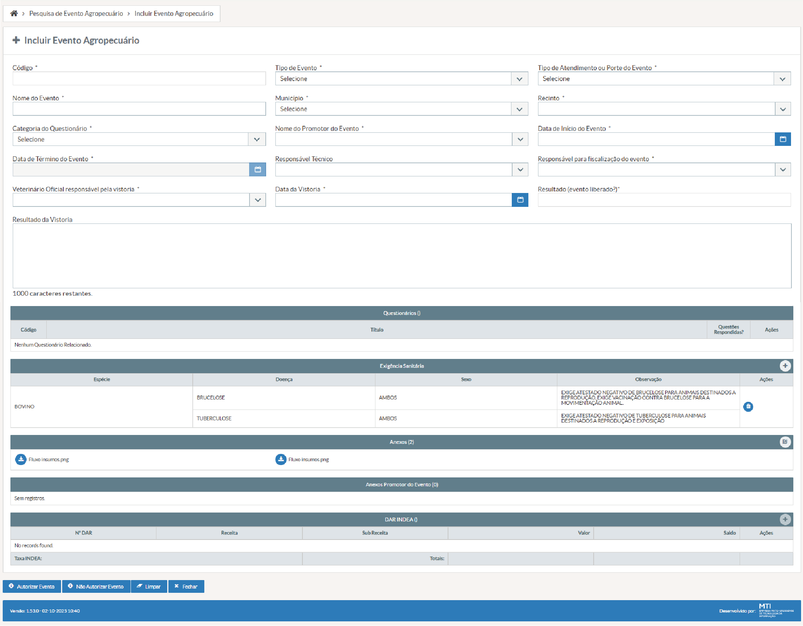

# US001 - Incluir Evento Agropecuário 
#### STRY0087120 ok

## DESCRIÇÃO

**Título da Tela:** + Incluir Evento Agropecuário
**Caminho de navegação (breadcrumb):** Pesquisa de Evento Agropecuário > Incluir Evento Agropecuário

**EU COMO** servidor fiscal veterinário do INDEA
**QUERO** cadastrar e gerenciar eventos agropecuários no sistema, incluindo todas as informações obrigatórias (dados do evento, questionários, exigências sanitárias, anexos e documentação fiscal)
**PARA QUE** eu possa controlar e autorizar a realização de eventos com segurança sanitária animal, garantindo o cumprimento das normas regulamentares e a rastreabilidade das atividades pecuárias no estado.

## PROTÓTIPO DE TELA

*Figura 1: Tela de inclusão de receituário de brucelose com campos para veterinário, produtor, estabelecimento e composição*

## 1. Critérios de Aceitação - Campos

#### i) Código do Evento

- **Título**: Código
- **Tipo do Campo**: Texto
- **Estado Inicial**: Vazio
- **Preenchimento do Campo**: Apenas visualização
- **Visibilidade**: Visível após primeiro salvamento
- **Tamanho Máximo**: 20 caracteres
- **Valor Único**: Sim (código único por evento)
- **Valor de Preenchimento Automático**: Gerado automaticamente pelo sistema após primeira gravação
- **Validação de Formato**: Alfanumérico sequencial (formato: EVT-AAAA-NNNNNN)

#### ii) Tipo de Evento

- **Título**: Tipo de Evento
- **Tipo do Campo**: Seleção Única (Dropdown)
- **Opções**: Lista de tipos de eventos (tabela: tipos_evento)
- **Seleção**: Uma opção obrigatória
- **Estado Inicial**: Placeholder "Selecione o tipo de evento"
- **Preenchimento do Campo**: Obrigatório
- **Visibilidade**: Sempre visível
- **Validações Extras**: Deve ser um tipo válido cadastrado no sistema

#### iii) Tipo de Atendimento ou Porte do Evento

- **Título**: Tipo de Atendimento ou Porte do Evento
- **Tipo do Campo**: Seleção Única (Dropdown)
- **Opções**: lista de Tipo de Atendimento ou Porte do Evento (banco de dados)
- **Seleção**: Uma opção obrigatória
- **Estado Inicial**: Placeholder "Selecione"
- **Preenchimento do Campo**: Obrigatório
- **Visibilidade**: Sempre visível
- **Lista de Valores Permitidos**: Pequeno, Médio, Grande, Extra Grande
- **Validações Extras**: Porte deve ser compatível com o tipo de evento selecionado

#### iv) Nome do Evento

- **Título**: Nome do Evento
- **Tipo do Campo**: Texto
- **Estado Inicial**: Vazio
- **Preenchimento do Campo**: Obrigatório
- **Visibilidade**: Sempre visível
- **Tamanho Mínimo**: 5 caracteres
- **Tamanho Máximo**: 150 caracteres
- **Valor Único**: Sim (por município e período)
- **Validações Extras**: Não pode conter apenas números ou caracteres especiais

#### v) Município

- **Título**: Município
- **Tipo do Campo**: Seleção Única (Dropdown)
- **Opções**: Lista de municípios do estado de MT 
- **Seleção**: Uma opção obrigatória
- **Estado Inicial**: Placeholder "Selecione o município"
- **Preenchimento do Campo**: Obrigatório
- **Visibilidade**: Sempre visível
- **Validações Extras**: Deve ser um município válido de MT; influencia na listagem de recintos disponíveis

#### vi) Recinto

- **Título**: Recinto do Evento
- **Tipo do Campo**: Seleção Única (Dropdown)
- **Opções**: Lista de recintos filtrada por município selecionado
- **Seleção**: Uma opção obrigatória
- **Estado Inicial**: Desabilitado até seleção do município
- **Preenchimento do Campo**: Condicionado (obrigatório após seleção do município)
- **Visibilidade**: Visível, mas habilitado apenas após seleção do município
- **Validações Extras**: Deve ser um recinto válido e ativo no município selecionado

#### vii) Categoria do Questionário

- **Título**: Categoria do Questionário
- **Tipo do Campo**: Seleção Única (Dropdown)
- **Opções**: Lista de categorias de questionários 
- **Seleção**: Uma opção obrigatória
- **Estado Inicial**: Placeholder "Selecione a categoria"
- **Preenchimento do Campo**: Obrigatório
- **Visibilidade**: Sempre visível
- **Lista de Valores Permitidos**: Bovinos, Equinos, Suínos, Aves, Outros
- **Validações Extras**: Categoria deve ser compatível com o tipo de evento

#### viii) Promotor do Evento

- **Título**: Promotor do Evento
- **Tipo do Campo**: Seleção Única (Dropdown)
- **Opções**: Lista de promotores cadastrados 
- **Seleção**: Uma opção obrigatória
- **Estado Inicial**: Vazio
- **Preenchimento do Campo**: Obrigatório
- **Visibilidade**: Sempre visível
- **Validações Extras**: Promotor deve estar ativo e ter documentação em dia

#### ix) Data de Início do Evento

- **Título**: Data de Início
- **Tipo do Campo**: Data
- **Estado Inicial**: Vazio com placeholder "dd/mm/aaaa"
- **Preenchimento do Campo**: Obrigatório
- **Visibilidade**: Sempre visível
- **Valor Mínimo**: Data atual (não pode ser no passado)
- **Valor Máximo**: 365 dias a partir da data atual
- **Validação de Formato**: dd/mm/aaaa
- **Validações Extras**: Deve ser anterior à data de término; não pode ser em fins de semana ou feriados (configurável)

#### x) Data de Término do Evento

- **Título**: Data de Término
- **Tipo do Campo**: Data
- **Estado Inicial**: Vazio com placeholder "dd/mm/aaaa"
- **Preenchimento do Campo**: Obrigatório
- **Visibilidade**: Sempre visível
- **Valor Mínimo Condicional**: Deve ser igual ou posterior à data de início
- **Valor Máximo**: 30 dias após a data de início
- **Validação de Formato**: dd/mm/aaaa
- **Validações Extras**: Período máximo de evento é 30 dias consecutivos

#### xi) Responsável Técnico

- **Título**: Responsável Técnico
- **Tipo do Campo**: Seleção Única (Dropdown)
- **Opções**: Lista de responsáveis técnicos ativos 
- **Seleção**: Uma opção obrigatória
- **Estado Inicial**: Placeholder "Selecione o responsável técnico"
- **Preenchimento do Campo**: Obrigatório
- **Visibilidade**: Sempre visível
- **Validações Extras**: Responsável deve ter registro ativo no conselho profissional

#### xii) Responsável para Fiscalização

- **Título**: Responsável para Fiscalização do Evento
- **Tipo do Campo**: Seleção Única (Dropdown)
- **Opções**: Lista filtrada de servidores que são fiscais E veterinários 
- **Seleção**: Uma opção obrigatória
- **Estado Inicial**: Placeholder "Selecione o fiscal veterinário"
- **Preenchimento do Campo**: Obrigatório
- **Visibilidade**: Sempre visível
- **Validações Extras**: CRÍTICO - Além das permissões já concedidas, o responsável pela fiscalização também deve poder ser "servidor fiscal" com profissão "veterinário" simultaneamente.

#### xiii) Veterinário Oficial para Vistoria

- **Título**: Veterinário Oficial Responsável pela Vistoria
- **Tipo do Campo**: Seleção Única (Dropdown)
- **Opções**: Lista de veterinários oficiais do INDEA (tabela: veterinarios_oficiais)
- **Seleção**: Uma opção obrigatória
- **Estado Inicial**: Placeholder "Selecione o veterinário oficial"
- **Preenchimento do Campo**: Obrigatório
- **Visibilidade**: Sempre visível
- **Validações Extras**: Veterinário deve estar ativo e ter competência territorial para o município do evento

#### xiv) Data da Vistoria

- **Título**: Data da Vistoria
- **Tipo do Campo**: Data
- **Estado Inicial**: Vazio com placeholder "dd/mm/aaaa"
- **Preenchimento do Campo**: Obrigatório
- **Visibilidade**: Sempre visível
- **Valor Mínimo**: Data atual
- **Valor Máximo Condicional**: Deve ser anterior ou igual à data de início do evento
- **Validação de Formato**: dd/mm/aaaa
- **Validações Extras**: Deve permitir pelo menos 5 dias úteis entre vistoria e início do evento

#### xv) Status do Evento

- **Título**: Resultado (Evento liberado?)
- **Tipo do Campo**: Texto
- **Estado Inicial**: "AGUARDANDO VISTORIA"
- **Preenchimento do Campo**: Apenas visualização
- **Visibilidade**: Sempre visível
- **Lista de Valores Permitidos**: "AGUARDANDO VISTORIA", "LIBERADO", "NÃO AUTORIZADO", "CANCELADO"
- **Valor de Preenchimento Automático**: Atualizado automaticamente conforme fluxo de aprovação
- **Validações Extras**: Mudança de status segue workflow específico

#### xvi) Resultado da Vistoria

- **Título**: Resultado da Vistoria
- **Tipo do Campo**: Texto (Área de Texto)
- **Estado Inicial**: Vazio
- **Preenchimento do Campo**: Opcional
- **Visibilidade**: Sempre visível
- **Tamanho Mínimo**: 10 caracteres (se preenchido)
- **Tamanho Máximo**: 1000 caracteres
- **Validações Extras**: Contador regressivo de caracteres; obrigatório se evento não for liberado

## 2. Critérios de Aceitação – Seção "Questionários ( )"

### i) Tabela de Dados

- **Status inicial:** deve-se exibir a mensagem "Sem registros." Se não houver questionários cadastrados, deve exibir a mensagem "Nenhum Questionário Relacionado".
- **Tipo:** tabela de dados
- **Preenchimento:** obrigatório, quando houver questionários
  - 4 colunas (Código, Título, Questões Respondidas? e Ações)
  - A coluna "Ações" deve possuir três botões com as respectivas ações: visualizar, editar e excluir
- **Visibilidade:** sempre visível
- **Detalhamentos das colunas:** "Código", "Título", "Questões Respondidas?" e "Ações"

#### 1) Código

- **Status inicial:** código do questionário, carregado do banco de dados
- **Tipo:** coluna de tabela
- **Preenchimento:** obrigatório, não editável
- **Visibilidade:** sempre visível

#### 2) Título

- **Status inicial:** título do questionário, carregado do banco de dados
- **Tipo:** coluna de tabela
- **Preenchimento:** obrigatório, não editável
- **Visibilidade:** sempre visível

#### 3) Questões Respondidas

- **Status inicial:** questões respondidas do questionário, carregado do banco de dados 
- **Tipo:** coluna de tabela
- **Preenchimento:** obrigatório, não editável
- **Visibilidade:** sempre visível

#### 4) Ações

- **Status inicial:** 3 (três) botões com as seguintes funcionalidades:

##### a.1) Visualizar

- **Status inicial:** desabilitado, caso não haja entidade carregada do banco de dados
- **Tipo:** botão
- **Preenchimento:** ícone de LUPA
- **Visibilidade:** caso haja entidade, visível e clicável; caso não haja, visível, mas não clicável
- **Regra de negócio:** ao passar o ponteiro do mouse sobre o botão Visualizar, deve ser exibida a mensagem "Editar"
- **Classificação da Ação:** Ação Apenas em Tela
- **Ação realizada:** Abre modal/tela para visualização do questionário selecionado em modo somente leitura
- **Destino da navegação:** Modal de visualização de questionário ou nova janela sobreposta
- **Validações:** Carrega dados completos do questionário sem permitir edição

##### a.2) Editar

- **Status inicial:** desabilitado, caso não haja entidade carregada do banco dados
- **Tipo:** botão
- **Preenchimento:** ícone de LÁPIS
- **Visibilidade:** caso haja entidade, visível e clicável; caso não haja, visível, mas não clicável
- **Regra de negócio:** ao passar o ponteiro do mouse sobre o botão Editar, deve ser exibida a seguinte escrita ""
- **Classificação da Ação:** Ação Apenas em Tela
- **Ação realizada:** Abre tela de edição do questionário selecionado
- **Destino da navegação:** Tela de edição de questionário (modal ou nova tela)
- **Validações:** Verifica permissão de edição do usuário

##### a.3) Apagar

- **Status inicial:** desabilitado, caso não haja entidade
- **Tipo:** botão
- **Preenchimento:** ícone de LIXEIRA
- **Visibilidade:** caso haja entidade, visível e clicável; caso não haja, visível, mas não clicável
- **Regra de negócio:** ao passar o ponteiro do mouse sobre o botão Apagar, deve ser exibida a mensagem "Apagar"
- **Classificação da Ação:** Ações Práticas
- **Ação realizada:** Remove o questionário selecionado da lista
- **Destino da navegação:** Permanece na tela atual (atualiza lista)
- **Validações:** Solicita confirmação: "Deseja realmente remover este questionário?"; Remove apenas a vinculação, não exclui o questionário do sistema

- **Tipo:** coluna de tabela
- **Preenchimento:** obrigatório, não editável
- **Visibilidade:** sempre visível
- **Regra de negócio:** caso não haja entidade carregada do banco de dados, deve ser exibida a mensagem "Sem registros"

## 3. Critérios de Aceitação – Seção "Exigência Sanitária"

### i) Tabela de Dados

- **Status inicial:**
  - Tabela de dados vazia com o título "Exigência Sanitária" e um botão "+" no canto superior direito, com um tooltip com a mensagem "Adicionar nova exigência sanitária"
  - No corpo da tabela, deve-se exibir a mensagem padrão "Sem registros." se não houver exigências sanitárias cadastradas
- **Tipo:** tabela de dados
- **Preenchimento:** obrigatório quando há entidade carregada do banco de dados
- **Visibilidade:** sempre visível
- **Regra de negócio:** somente servidor fiscal que seja 'veterinário' ou 'responsável pelo evento' podem realizar a inserção dos DAR's de exigência sanitária

#### Botão "Adição de Nova Exigência Sanitária"

- **Status inicial:** habilitado e funcional
- **Tipo:** botão
- **Preenchimento:** ícone de "+"
- **Visibilidade:** sempre visível
- **Regra de negócio:**
  - a exigência sanitária está associada à Espécie cadastrada e ao Tipo de Evento, ou seja, tudo previamente cadastrado no banco
  - ao ser clicado, deve levar o usuário para a tela de cadastro de nova exigência sanitária
  - no corpo da tabela, deve-se exibir a mensagem padrão "Sem registros." se não houver anexos cadastrados
- **Classificação da Ação:** Ação Apenas em Tela
- **Ação realizada:** Abre tela de cadastro de nova exigência sanitária
- **Destino da navegação:** Tela de "Cadastro de Exigência Sanitária"
- **Validações:** Disponível apenas para servidor fiscal que seja veterinário OU responsável pelo evento; Exigência deve estar vinculada à espécie e tipo de evento já cadastrados

#### Detalhamento das Colunas

##### 1) Espécie

- **Status inicial:** caso haja, deve exibir espécie carregada do banco de dados
- **Tipo:** coluna de tabela
- **Preenchimento:** obrigatório
- **Visibilidade:** sempre visível

##### 2) Doença

- **Status inicial:** caso haja, deve exibir doença carregada do banco de dados
- **Tipo:** coluna de tabela
- **Preenchimento:** obrigatório
- **Visibilidade:** sempre visível

##### 3) Sexo

- **Status inicial:** caso haja, deve exibir sexo carregado do banco de dados, sendo MACHO, FÊMEA ou AMBOS
- **Tipo:** coluna de tabela
- **Preenchimento:** obrigatório
- **Visibilidade:** sempre visível

##### 4) Ações

- **Status inicial:** 1 (um) botão com a seguinte funcionalidade:

###### a.1) Apagar

- **Status inicial:** caso haja entidade, visível e clicável; caso não haja, visível, mas não clicável
- **Tipo:** botão
- **Preenchimento:** ícone de LIXEIRA
- **Visibilidade:** caso haja entidade, visível e clicável; caso não haja, visível, mas não clicável
- **Classificação da Ação:** Ações Práticas
- **Ação realizada:** Remove a exigência sanitária selecionada
- **Destino da navegação:** Permanece na tela atual (atualiza lista)
- **Validações:** Solicita confirmação antes da exclusão; Remove a exigência da lista do evento

- **Tipo:** coluna de tabela
- **Preenchimento:** 1 botão de ação
- **Visibilidade:** sempre visível

## 4. Critérios de Aceitação – Seção "Anexos ( )"

### i) Tabela de Dados

- **Status inicial:**
  - Tabela de dados vazia com o título "Anexos" e um botão "+" no canto superior direito
  - No corpo da tabela, deve-se exibir a mensagem padrão "Sem registros." se não houver anexos cadastrados
- **Tipo:** tabela de dados
- **Preenchimento:** opcional
- **Visibilidade:** sempre visível

#### Botão "Adição de Novo Anexo"

- **Status inicial:** habilitado e funcional
- **Tipo:** botão
- **Preenchimento:** ícone de CLIPE DE PAPEL
- **Visibilidade:** sempre visível
- **Regra de negócio** 
  - ao passar o mouse sobre o botão, deve ser exibida a mensagem "Editar".
  - ao clicar no botão "Aicionar novo anexo", o usuário deve ser levado para a tela de "Manter Anexos", representada em outra estória
  - a opção de removeção de anexo deve constar na tela de "Manter Anexos"
- **Classificação da Ação:** Ação Apenas em Tela
- **Ação realizada:** Abre tela de gerenciamento de anexos
- **Destino da navegação:** Tela de "Manter Anexos" (outra estória)
- **Validações:** Permite upload de múltiplos tipos de arquivo; Controla limite de tamanho e quantidade de anexos

#### Detalhamento das Colunas

##### 1) Regra de negócio sobre a apresentação visual dos anexos

 - **Colunas:** 
   - não deve haver colunas visíveis na tabela, as linhas da coluna devem ter cor transparente.
   - a cada anexo carregado, deve-se carregá-lo na seguinte ordem: um após o outro da esquerda para a direita
   - cada anexo deve ser carregado em uma nova coluna até o limite de 4 anexos
   - ao atingir o limite quatro na mesma linha, deve-se colocar um novo anexo numa nova linha

## 5. Critérios de Aceitação – Seção "Anexos Promotor do Evento ( )"

### i) Tabela de Dados

- **Status inicial:**
  - Tabela de dados vazia com o título "Anexos Promotor de Evento ()"
  - No corpo da tabela, deve-se exibir a mensagem padrão "Sem registros." se não houver anexos cadastrados
- **Tipo:** tabela de dados
- **Preenchimento:** opcional
- **Visibilidade:** sempre visível

#### Detalhamento das Colunas

##### 1) Regra de negócio sobre a apresentação visual dos anexos

 - **Colunas:** 
   - não deve haver colunas visíveis na tabela, as linhas da coluna devem ter cor transparente.
   - a cada anexo carregado, deve-se carregá-lo na seguinte ordem: um após o outro da esquerda para a direita
   - cada anexo deve ser carregado em uma nova coluna até o limite de 4 anexos
   - ao atingir o limite quatro na mesma linha, deve-se colocar um novo anexo numa nova linha

## 6. Critérios de Aceitação – Seção "DAR INDEA ( )"

### i) Tabela de Dados

- **Status inicial:** 
  - Tabela de dados vazia com o título "DAR INDEA ()"
  - No corpo da tabela, deve-se exibir a mensagem padrão "Sem registros." se não houver DARs cadastrados
- **Tipo:** tabela
- **Preenchimento:** obrigatório
  - 6 colunas (Nº DAR, Receita, Sub Receita, Valor, Saldo e Ações)
  - A coluna "Ações" deve possuir 3 botões com as respectivas ações: visualizar, editar e deletar
- **Visibilidade:** sempre visível

#### Detalhamento das Colunas

##### 1) Nº DAR

- **Status inicial:** vazio, caso não haja entidade carregada do banco de dados
- **Tipo:** coluna de tabela
- **Preenchimento:** obrigatório, não editável
- **Visibilidade:** sempre visível

##### 2) Receita

- **Status inicial:** vazio, caso não haja entidade carregada do banco de dados
- **Tipo:** coluna de tabela
- **Preenchimento:** obrigatório, não editável
- **Visibilidade:** sempre visível

##### 3) Sub Receita

- **Status inicial:** vazio, caso não haja entidade carregada do banco de dados
- **Tipo:** coluna de tabela
- **Preenchimento:** obrigatório, não editável
- **Visibilidade:** sempre visível

##### 4) Valor

- **Status inicial:** vazio, caso não haja entidade carregada do banco de dados
- **Tipo:** coluna de tabela
- **Preenchimento:** obrigatório, não editável
- **Visibilidade:** sempre visível

##### 5) Saldo

- **Status inicial:** vazio, caso não haja entidade carregada do banco de dados
- **Tipo:** coluna de tabela
- **Preenchimento:** obrigatório, não editável
- **Visibilidade:** sempre visível

##### 6) Ações

- **Status inicial:** 3 (dois) botões com as seguintes funcionalidades:

###### a.1) Visualizar

- **Status inicial:** caso haja entidade, habilitado; caso não haja, não habilitado
- **Tipo:** botão
- **Preenchimento:** ícone de LUPA
- **Visibilidade:** caso haja entidade, visível; caso não haja, não visível
- **Classificação da Ação:** Ação Apenas em Tela
- **Ação realizada:** Exibe detalhes completos do DAR selecionado
- **Destino da navegação:** Modal/tela de visualização de DAR
- **Validações:** Modo somente leitura; Exibe histórico de pagamentos e status

###### a.1) Editar

- **Status inicial:** caso haja entidade, habilitado; caso não haja, não habilitado
- **Tipo:** botão
- **Preenchimento:** ícone de LÁPIS
- **Visibilidade:** caso haja entidade, visível; caso não haja, não visível
- **Classificação da Ação:** Ação Apenas em Tela
- **Ação realizada:** Permite edição dos dados do DAR selecionado
- **Destino da navegação:** Tela de edição de DAR
- **Validações:** Verifica se DAR não foi pago (editável apenas se pendente); Valida permissões do usuário para alteração fiscal

###### a.2) Deletar

- **Status inicial:** caso haja entidade, habilitado; caso não haja, não habilitado
- **Tipo:** botão
- **Preenchimento:** ícone de LIXEIRA
- **Visibilidade:** caso haja entidade, visível; caso não haja, não visível
- **Classificação da Ação:** Ações Práticas
- **Ação realizada:** Remove o DAR selecionado da lista
- **Destino da navegação:** Permanece na tela atual (atualiza lista)
- **Validações:** Solicita confirmação com aviso sobre impacto fiscal; Permite exclusão apenas se DAR não foi pago; Registra log de auditoria da exclusão

- **Tipo:** coluna de tabela
- **Preenchimento:** obrigatório (3 botões), quando há entidade carregada do banco de dados
- **Visibilidade:** sempre visível

## 7. Critérios de Aceitação – Ações

- **Botões na parte infeior da página** deve haver 4 botões logo após a tabela "DAR INDEA ()", sendo: autorizar evento, não autorizar evento, limpar e fechar

### i) Botão "Autorizar Evento"

- **Status inicial:** habilitado e funcional
- **Tipo:** botão
- **Preenchimento:** texto "Autorizar Evento"
- **Visibilidade:** sempre visível
- **Funcionalidade:**
  - Submete o evento para autorização
  - Deve validar todas as condições obrigatórias antes da submissão
- **Classificação da Ação:** Ações Práticas
- **Ação realizada:** Processa autorização completa do evento agropecuário
- **Destino da navegação:** Tela de confirmação de autorização ou listagem de eventos
- **Validações:** Executa TODAS as validações obrigatórias do formulário; Verifica se responsável para fiscalização é fiscal E veterinário; Valida datas (vistoria 5 dias antes do início, período máximo 30 dias); Confirma preenchimento de questionários obrigatórios; Verifica exigências sanitárias cadastradas; Valida se há pelo menos um DAR cadastrado; Atualiza status do evento para "LIBERADO"; Gera notificações automáticas para envolvidos

### ii) Botão "Não autorizar evento"

- **Status inicial:** habilitado e funcional
- **Tipo:** botão
- **Preenchimento:** texto "Não autorizar evento"
- **Visibilidade:** sempre visível
- **Funcionalidade:**
  - Registra a não autorização do evento
  - Deve solicitar justificativa para não autorização
  - Ao ser clicado, abre um modal para inserção da justificativa de não autorização, outra estória.
- **Classificação da Ação:** Ações Práticas
- **Ação realizada:** Registra não autorização com justificativa obrigatória
- **Destino da navegação:** Modal de justificativa, depois retorna para listagem
- **Validações:** Abre modal obrigatório para inserção de justificativa; Justificativa deve ter mínimo de 20 caracteres; Atualiza status do evento para "NÃO AUTORIZADO"; Registra data/hora e usuário responsável pela decisão; Envia notificação automática ao promotor do evento

### iii) Botão "Limpar"

- **Status inicial:** habilitado e funcional
- **Tipo:** botão
- **Preenchimento:** texto "Limpar"
- **Visibilidade:** sempre visível
- **Funcionalidade:**
  - Limpa todos os campos preenchidos no formulário
  - Mantém apenas os dados básicos do evento
  - Solicita confirmação antes da execução
- **Classificação da Ação:** Link
- **Ação realizada:** Limpa todos os campos editáveis do formulário
- **Destino da navegação:** Permanece na tela atual (resetada)
- **Validações:** Solicita confirmação: "Deseja realmente limpar todos os dados?"; Mantém apenas dados básicos fixos do evento; Limpa todas as tabelas (questionários, exigências, anexos, DARs); Redefine campos para estado inicial; Não afeta dados já salvos no banco

### iv) Botão "Fechar"

- **Status inicial:** habilitado e funcional
- **Tipo:** botão
- **Preenchimento:** texto "Fechar"
- **Visibilidade:** sempre visível
- **Funcionalidade:**
  - Fecha a tela atual sem salvar alterações
  - Retorna para a tela anterior
  - Solicita confirmação se houver alterações não salvas
- **Classificação da Ação:** Link
- **Ação realizada:** Fecha a tela de cadastro de evento
- **Destino da navegação:** Tela de "Pesquisa de Evento Agropecuário"
- **Validações:** Detecta alterações não salvas no formulário; Se houver alterações: modal "Existem dados não salvos. Deseja salvar antes de fechar?"; Opções: "Salvar e Fechar" / "Fechar sem Salvar" / "Cancelar"; Se não houver alterações: fecha diretamente; Limpa dados temporários da sessão; Preserva filtros da tela de pesquisa anterior

## 8. Requisitos Considerados

- **RF-AC-001 – Fiscalização de Eventos por Veterinário Fiscal:** O sistema deve passar a permitir, também, a designação de responsáveis pela fiscalização aos servidores que acumulem o cargo de fiscal e a profissão veterinário.

- **Requisitos nas palavras do cliente**
 MÓDULO ANIMAL - Permitir que o servidor, CARGO FISCAL ESTADUAL DE DEFESA AGROPECUÁRIA E VETERINÁRIO, com situação ATIVO, possa LISTAR no campo RESPONSÁVEL PELA FISCALIZAÇÃO DO EVENTO, funcionalidade EVENTO AGROPECUÁRIO sem a necessidade de qualificar profissional.

