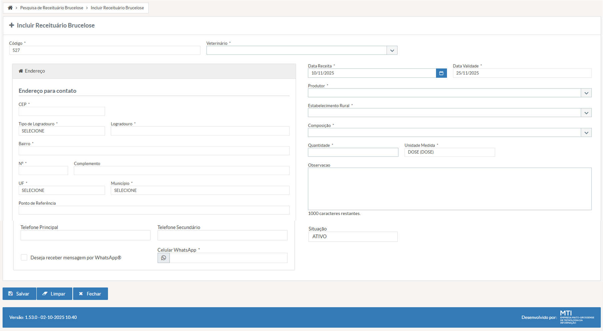

# US002 - Incluir Receituário de Brucelose
#### STRY0087153

## DESCRIÇÃO

**Título da Tela:** + Incluir Receituário Brucelose
**Caminho de navegação (breadcrumb):** Pesquisa de Receituário Brucelose > Incluir Receituário Brucelose

**EU COMO** servidor fiscal veterinário do INDEA
**QUERO** cadastrar receituários específicos para brucelose no sistema, incluindo todas as informações obrigatórias (dados do veterinário, produtor, estabelecimento, composição, quantidade e endereço completo)
**PARA QUE** eu possa registrar prescrições veterinárias para o controle e tratamento da brucelose animal, atendendo às exigências legais e sanitárias, garantindo a rastreabilidade dos tratamentos e o cumprimento das normas regulamentares de saúde animal.

---

## PROTÓTIPO DE TELA

*Figura 1: Tela de inclusão de receituário de brucelose com campos para veterinário, produtor, estabelecimento e composição*

---

## 1. Critérios de Aceitação - Campos

#### i) Código do Receituário

- **Título**: Código
- **Tipo do Campo**: Texto
- **Estado Inicial**: Vazio
- **Preenchimento do Campo**: Apenas visualização
- **Visibilidade**: Visível após primeiro salvamento
- **Tamanho Máximo**: 25 caracteres
- **Valor Único**: Sim (código único por receituário)
- **Valor de Preenchimento Automático**: Gerado automaticamente pelo sistema 
- **Validação de Formato**: Alfanumérico sequencial para receituários de brucelose

#### ii) Veterinário Responsável

- **Título**: Veterinário
- **Tipo do Campo**: Seleção Única (Autocomplete com Dropdown)
- **Opções**: Lista filtrada de servidores que são fiscais E veterinários (view: fiscais_veterinarios_brucelose)
- **Seleção**: Uma opção obrigatória
- **Estado Inicial**: Vazio
- **Preenchimento do Campo**: Obrigatório
- **Visibilidade**: Sempre visível
- **Validações Extras**: CRÍTICO - O campo de seleção de veterinário deve listar, além dos que já estão listados hoje, servidores que sejam fiscais e veterinários ativos.

#### iii) Data da Receita

- **Título**: Data Receita
- **Tipo do Campo**: Data
- **Estado Inicial**: Data atual do sistema pré-preenchida
- **Preenchimento do Campo**: Obrigatório
- **Visibilidade**: Sempre visível
- **Valor Mínimo**: Data atual
- **Valor Máximo**: Data atual
- **Validação de Formato**: dd/mm/aaaa
- **Valor de Preenchimento Automático**: Data atual do sistema
- **Validações Extras**: Não pode ser data futura

#### iv) Data de Validade

- **Título**: Data Validade
- **Tipo do Campo**: Data
- **Estado Inicial**: Calculada automaticamente (Data Receita + 30 dias)
- **Preenchimento do Campo**: Obrigatório
- **Visibilidade**: Sempre visível
- **Valor Mínimo Condicional**: Deve ser posterior à data da receita
- **Valor Máximo Condicional**: Data da receita + 15 dias (de acordo com lógica já implementada)
- **Validação de Formato**: dd/mm/aaaa
- **Valor de Preenchimento Automático**: Data da receita + 30 dias (padrão para brucelose)
- **Validações Extras**: Atualizada automaticamente quando data da receita for alterada

#### v) Produtor

- **Título**: Produtor
- **Tipo do Campo**: Seleção Única (Autocomplete com Dropdown)
- **Opções**: Lista de produtores cadastrados e ativos 
- **Seleção**: Uma opção obrigatória
- **Estado Inicial**: Vazio
- **Preenchimento do Campo**: Obrigatório
- **Visibilidade**: Sempre visível
- **Validações Extras**: Produtor deve estar ativo e com documentação regularizada; busca por CPF/CNPJ ou nome

#### vi) Estabelecimento Rural

- **Título**: Estabelecimento Rural
- **Tipo do Campo**: Seleção Única (Autocomplete com Dropdown)
- **Opções**: Lista de estabelecimentos vinculados ao produtor selecionado
- **Seleção**: Uma opção obrigatória
- **Estado Inicial**: Desabilitado até seleção do produtor
- **Preenchimento do Campo**: Condicionado (obrigatório após seleção do produtor)
- **Visibilidade**: Visível, mas habilitado apenas após seleção do produtor
- **Validações Extras**: Deve ser estabelecimento válido e ativo vinculado ao produtor selecionado

#### vii) Composição do Medicamento

- **Título**: Composição
- **Tipo do Campo**: Seleção Única (Autocomplete com Dropdown)
- **Opções**: Lista de composições aprovadas para brucelose 
- **Seleção**: Uma opção obrigatória
- **Estado Inicial**: Vazio
- **Preenchimento do Campo**: Obrigatório
- **Visibilidade**: Sempre visível
- **Lista de Valores Permitidos**: Apenas medicamentos registrados e autorizados para brucelose
- **Validações Extras**: Composição deve estar ativa e aprovada pelo MAPA para uso em brucelose

#### viii) Quantidade Prescrita

- **Título**: Quantidade
- **Tipo do Campo**: Número Decimal
- **Estado Inicial**: Vazio
- **Preenchimento do Campo**: Obrigatório
- **Visibilidade**: Sempre visível
- **Valor Mínimo**: 0.01
- **Valor Máximo**: 9999.99
- **Validação de Formato**: Até 2 casas decimais
- **Validações Extras**: Deve ser valor positivo; validação de quantidade máxima baseada na composição selecionada

#### ix) Unidade de Medida

- **Título**: Unidade Medida
- **Tipo do Campo**: Seleção Única (Autocomplete com Dropdown)
- **Opções**: Lista de unidades de medida cadastradas 
- **Seleção**: Uma opção obrigatória
- **Estado Inicial**: Pré-selecionado "DOSE (DOSE)"
- **Preenchimento do Campo**: Obrigatório
- **Visibilidade**: Sempre visível
- **Lista de Valores Permitidos**: DOSE, ML, COMPRIMIDO, FRASCO, AMPOLA (conforme medicamento)
- **Valor de Preenchimento Automático**: "DOSE (DOSE)" como padrão para brucelose
- **Validações Extras**: Unidade deve ser compatível com a composição selecionada

#### x) Observações

- **Título**: Observação
- **Tipo do Campo**: Texto (Área de Texto)
- **Estado Inicial**: Vazio
- **Preenchimento do Campo**: Opcional
- **Visibilidade**: Sempre visível
- **Tamanho Máximo**: 1000 caracteres
- **Validações Extras**: Contador regressivo de caracteres exibido; recomendado para casos especiais

#### xi) Situação do Receituário

- **Título**: Situação
- **Tipo do Campo**: Seleção Única (Dropdown)
- **Opções**: Lista de situações (valores fixos)
- **Seleção**: Uma opção
- **Estado Inicial**: Pré-selecionado "ATIVO"
- **Preenchimento do Campo**: Obrigatório
- **Visibilidade**: Sempre visível
- **Lista de Valores Permitidos**: ATIVO, CANCELADO, EXPIRADO
- **Valor de Preenchimento Automático**: "ATIVO" para novos receituários
- **Validações Extras**: Situação CANCELADO requer justificativa; EXPIRADO é controlado automaticamente pelo sistema

## 2. Critérios de Aceitação – Seção "Endereço"

### i) Painel de Endereço

- **Título**: Endereço para Contato
- **Tipo do Campo**: Painel/Seção
- **Estado Inicial**: Painel expandido com título "Endereço" e subtítulo "Endereço para contato"
- **Preenchimento do Campo**: Obrigatório (seção completa)
- **Visibilidade**: Sempre visível
- **Validações Extras**: Todos os campos obrigatórios devem ser preenchidos para completar o receituário

#### ii) CEP

- **Título**: CEP
- **Tipo do Campo**: Texto (com máscara)
- **Estado Inicial**: Vazio
- **Preenchimento do Campo**: Obrigatório
- **Visibilidade**: Sempre visível
- **Tamanho Máximo**: 9 caracteres (incluindo hífen)
- **Validação de Formato**: 00000-000 (formato brasileiro)
- **Valor de Preenchimento Automático**: Ao preencher CEP válido, busca e preenche automaticamente: Tipo de Logradouro, Logradouro, Bairro, UF e Município
- **Validações Extras**: Deve ser CEP válido existente; integração com API dos Correios

#### iii) Tipo de Logradouro

- **Título**: Tipo de Logradouro
- **Tipo do Campo**: Seleção Única (Dropdown)
- **Opções**: Lista de tipos de logradouro (valores fixos)
- **Seleção**: Uma opção obrigatória
- **Estado Inicial**: Vazio
- **Preenchimento do Campo**: Obrigatório
- **Visibilidade**: Sempre visível
- **Lista de Valores Permitidos**: AVENIDA, RUA, TRAVESSA, CORREDOR, ALAMEDA, PRAÇA, LARGO, RODOVIA, ESTRADA, NA PROPRIEDADE, COMUNIDADE, LINHA
- **Valor de Preenchimento Automático**: Preenchido pela busca do CEP (editável se necessário)

#### iv) Logradouro

- **Status inicial:** vazio
- **Tipo:** input text
- **Preenchimento:** obrigatório
- **Visibilidade:** sempre visível
- **Regra de negócio:** máximo de 40 caracteres

#### v) Bairro

- **Status inicial:** vazio
- **Tipo:** input text
- **Preenchimento:** obrigatório
- **Visibilidade:** sempre visível
- **Regra de negócio:** máximo de 40 caracteres

#### vi) Nº

- **Status inicial:** vazio
- **Tipo:** input text
- **Preenchimento:** obrigatório
- **Visibilidade:** sempre visível
- **Regra de negócio:** máximo de 10 caracteres

#### vii) Complemento

- **Status inicial:** vazio
- **Tipo:** input text
- **Preenchimento:** opcional
- **Visibilidade:** sempre visível
- **Regra de negócio:** máximo de 40 caracteres

#### viii) UF

- **Status inicial:** "SELECIONE", somente leitura
- **Tipo:** dropdown list
- **Preenchimento:** obrigatório
- **Visibilidade:** sempre visível
- **Regra de negócio:** ao selecionar UF, deve atualizar a lista de municípios disponíveis  

  

#### ix) Município

- **Status inicial:** "SELECIONE", somente leitura
- **Tipo:** dropdown list
- **Preenchimento:** obrigatório
- **Visibilidade:** sempre visível
- **Regra de negócio:** lista de municípios filtrada pela UF selecionada

#### x) Ponto de Referência

- **Status inicial:** vazio
- **Tipo:** input text
- **Preenchimento:** opcional
- **Visibilidade:** sempre visível
- **Regra de negócio:** máximo de 40 caracteres

#### xi) Telefone Principal

- **Status inicial:** vazio
- **Tipo:** input mask
- **Preenchimento:** opcional
- **Visibilidade:** sempre visível

#### xii) Telefone Secundário

- **Status inicial:** vazio
- **Tipo:** input mask
- **Preenchimento:** opcional
- **Visibilidade:** sempre visível

#### xiii) Deseja receber mensagem por WhatsApp®

- **Status inicial:** desmarcado, desabilitado
- **Tipo:** checkbox
- **Preenchimento:** opcional
- **Visibilidade:** sempre visível
- **Regra de negócio:** ao marcar, habilita o campo "Celular WhatsApp"

#### xiv) Celular WhatsApp

- **Status inicial:** vazio, desabilitado
- **Tipo:** input mask com ícone do WhatsApp  
- **Preenchimento:** obrigatório quando o checkbox WhatsApp estiver marcado
- **Visibilidade:** sempre visível

## 3. Critérios de Aceitação – Ações

### i) Botão Salvar

- **Título**: Salvar
- **Tipo do Campo**: Botão de Ação Principal
- **Estado Inicial**: Habilitado
- **Preenchimento do Campo**: Ação de sistema
- **Visibilidade**: Sempre visível
- **Validações Extras**: 
  - Executa validação completa de todos os campos obrigatórios
  - Verifica se veterinário selecionado é fiscal E veterinário
  - Valida data de validade posterior à data da receita
  - Verifica composição aprovada para brucelose
  - Valida formato e consistência do endereço completo
  - Após sucesso, exibe mensagem de confirmação e gera código do receituário
- **Regras de Negócio**: 
  - Desabilitado durante processamento
  - Gera numeração sequencial automática
- **Classificação da Ação:** Ações Práticas
- **Ação realizada:** Processa e grava o receituário de brucelose no sistema
- **Destino da navegação:** Permanece na tela atual com mensagem de sucesso ou retorna para listagem
- **Validações:** Executa TODAS as validações obrigatórias; Verifica dupla validação fiscal+veterinário; Valida datas e medicamentos aprovados; Confirma endereço completo e consistente; Gera código automático; Registra log de auditoria; Atualiza status para ATIVO

### ii) Botão Limpar

- **Título**: Limpar
- **Tipo do Campo**: Botão de Ação Secundário
- **Estado Inicial**: Habilitado
- **Preenchimento do Campo**: Ação de sistema
- **Visibilidade**: Sempre visível
- **Validações Extras**:
  - Solicita confirmação com modal: "Deseja realmente limpar todos os dados?"
  - Opções: "Sim, limpar" / "Cancelar"
  - Após confirmação, limpa todos os campos editáveis
  - Mantém valores padrão (Data atual, Unidade DOSE, Situação ATIVO)
  - Reset de campos dependentes (estabelecimento volta para desabilitado)
- **Regras de Negócio**:
  - Não afeta dados já salvos
  - Redefine foco para o primeiro campo editável
- **Classificação da Ação:** Link
- **Ação realizada:** Limpa todos os campos editáveis do formulário de receituário
- **Destino da navegação:** Permanece na tela atual (formulário resetado)
- **Validações:** Solicita confirmação antes da limpeza; Mantém valores padrão do sistema (data atual, unidade DOSE, situação ATIVO); Desabilita campos dependentes (estabelecimento); Redefine foco para primeiro campo; Não afeta dados já salvos no banco

### iii) Botão Fechar

- **Título**: Fechar
- **Tipo do Campo**: Botão de Ação Secundário
- **Estado Inicial**: Habilitado
- **Preenchimento do Campo**: Ação de sistema
- **Visibilidade**: Sempre visível
- **Validações Extras**:
  - Verifica se existem dados não salvos no formulário
  - Se houver alterações não salvas, exibe modal de confirmação:
    - "Existem dados não salvos. Deseja salvar antes de fechar?"
    - Opções: "Salvar e Fechar" / "Fechar sem Salvar" / "Cancelar"
  - Se não houver alterações, fecha diretamente
  - Retorna para tela de pesquisa de receituários
- **Regras de Negócio**:
  - Limpa dados temporários da sessão
  - Registra log de acesso para auditoria
- **Classificação da Ação:** Link
- **Ação realizada:** Fecha a tela de cadastro de receituário de brucelose
- **Destino da navegação:** Tela de "Pesquisa de Receituário Brucelose"
- **Validações:** Detecta alterações não salvas no formulário; Se houver alterações: modal com opções "Salvar e Fechar" / "Fechar sem Salvar" / "Cancelar"; Se não houver alterações: fecha diretamente; Limpa dados temporários da sessão; Registra log de acesso para auditoria; Preserva filtros da tela de pesquisa anterior

## 4. Requisitos Considerados

- **RF-AC-002 – Filtro de Veterinário no Receituário Brucelose:** O campo de seleção de veterinário deve listar, além dos que já estão listados hoje, servidores que sejam fiscais e veterinários ativos.

- **Requisitos nas palavras do cliente**
 MÓDULO ANIMAL - Permitir que o servidor, CARGO FISCAL ESTADUAL DE DEFESA AGROPECUÁRIA E VETERINÁRIO, com situação ATIVO, possa LISTAR no campo VETERINÁRIO da funcionalidade RECEITUÁRIO DE BRUCELOSE sem a necessidade de qualificar profissional

  