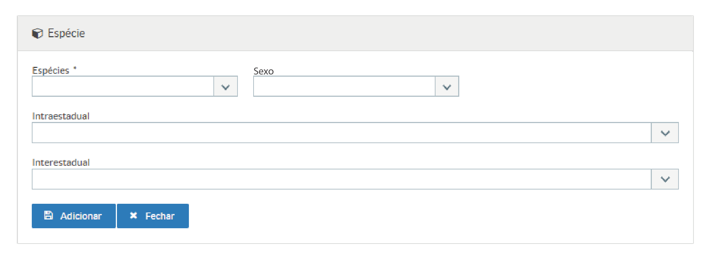

# US004 - Incluir espécie em Regras de Fundos
#### STRY0087163

## DESCRIÇÃO

**Título da Tela:** Espécie
**Observação:** Tela é um modal aberto dentro da tela "+ Incluir Regras Fundos"
**Caminho de navegação (breadcrumb):** Pesquisa de Regras dos Fundos > Incluir Regras Fundos > Botão "+" na tabela "Espécie"

**EU COMO** servidor do INDEA 
**QUERO** que o sistema permita configurar e aplicar valores de FETAB distintos para machos e fêmeas
**PARA QUE** eu possa cumprir a Lei Estadual MT nº 11.929/2023
---

## PROTÓTIPO DE TELA

*Figura 1: Modal de inclusão de espécie com campos para seleção de espécie, sexo, GTAs intraestaduais e interestaduais*

---

## 1. Critérios de Aceitação - Campos

### i) Espécies

- **Título**: Espécies
- **Tipo do Campo**: Autocomplete com Dropdown
- **Opções**: Lista de espécies cadastradas no sistema (tabela: especies)
- **Seleção**: Uma opção obrigatória
- **Estado Inicial**: Vazio
- **Preenchimento do Campo**: Obrigatório
- **Visibilidade**: Sempre visível
- **Validações Extras**: Espécie deve estar ativa no sistema; não pode ser duplicada na mesma regra de fundo

### ii) Sexo

- **Título**: Sexo
- **Tipo do Campo**: Seleção Única (Dropdown)
- **Opções**: Lista fixa: "MACHO", "FÊMEA", "INDIFERENTE"
- **Seleção**: Uma opção obrigatória
- **Estado Inicial**: Placeholder "Selecione o sexo"
- **Preenchimento do Campo**: Obrigatório
- **Visibilidade**: Sempre visível
- **Lista de Valores Permitidos**: MACHO, FÊMEA, INDIFERENTE
- **Validações Extras**: Deve ser compatível com a espécie selecionada
- **Funcionalidade**: Permite aplicação da Lei Estadual MT nº 11.929/2023
- **Integração**: Campo conectado ao sistema de cobrança diferenciada por sexo

### iii) Intraestadual

- **Título**: Intraestadual
- **Tipo do Campo**: Seleção Múltipla (Checkbox Menu)
- **Opções**: Lista de GTAs (Guias de Trânsito Animal) intraestaduais disponíveis
- **Seleção**: Múltiplas opções permitidas
- **Estado Inicial**: Vazio (nenhuma opção selecionada)
- **Preenchimento do Campo**: Opcional
- **Visibilidade**: Sempre visível
- **Validações Extras**: GTAs devem estar ativas e válidas para a espécie

### iv) Interestadual

- **Título**: Interestadual
- **Tipo do Campo**: Seleção Múltipla (Checkbox Menu)
- **Opções**: Lista de GTAs (Guias de Trânsito Animal) interestaduais disponíveis
- **Seleção**: Múltiplas opções permitidas
- **Estado Inicial**: Vazio (nenhuma opção selecionada)
- **Preenchimento do Campo**: Opcional
- **Visibilidade**: Sempre visível
- **Validações Extras**: GTAs devem estar ativas e válidas para a espécie

## 2. Critérios de Aceitação - Ações

### i) Botão "Adicionar"

- **Status inicial**: Habilitado (dependendo do preenchimento dos campos obrigatórios)
- **Tipo**: Botão com ícone
- **Preenchimento**: Ícone de disquete (fa fa-floppy-o) + texto "Adicionar"
- **Visibilidade**: Sempre visível
- **Classificação da Ação**: Ações Práticas
- **Ação realizada**: Adiciona a espécie à regra de fundo com as configurações selecionadas
- **Destino da navegação**: Permanece na tela atual (atualiza lista de espécies)
- **Validações**: 
  - Verifica se espécie foi selecionada
  - Verifica se sexo foi selecionado
  - Valida compatibilidade entre espécie e GTAs selecionadas
  - Impede duplicidade de espécie na mesma regra

### ii) Botão "Fechar"

- **Status inicial**: Sempre habilitado
- **Tipo**: Botão com ícone
- **Preenchimento**: Ícone de "X" (fa fa-close) + texto "Fechar"
- **Visibilidade**: Sempre visível
- **Classificação da Ação**: Link
- **Ação realizada**: Fecha a tela/modal de adição de espécie
- **Destino da navegação**: Retorna para tela anterior (lista de espécies da regra de fundo)
- **Validações**: 
  - Se houver dados não salvos, solicita confirmação
  - Limpa dados temporários da sessão

## 3. Regras / Validações / Ações Complexas

### i) Validação de Duplicidade por Sexo - **RF-FF-002**

- **Regra**: Não permitir adicionar a mesma espécie com o mesmo sexo na mesma regra de fundo
- **Validação**: Verificar no banco se já existe registro para mesma espécie + sexo + regra de fundo
- **Mensagem de Erro**: "Já existe cadastro para a espécie [nome_espécie] com sexo [sexo] nesta regra de fundo"
- **Requisito Relacionado**: RF-FF-002 - Validação de Duplicidade por Sexo
- **Exceção**: Permite múltiplos registros da mesma espécie quando os sexos forem diferentes
- **Comportamento**: Bloqueia salvamento se combinação espécie+sexo+regra já existir

## 4. Requisitos Considerados

- **RF-FF-001 – Campo Sexo nas Regras de Fundos:** Insere na tela de Espécie, o campo de seleção de sexo (Macho, Fêmea, Indiferente).
- **RF-FF-002 – Validação de Duplicidade por Sexo:** Impede o cadastro repetido da mesma espécie para o mesmo sexo dentro da regra, aceitando múltiplos registros apenas quando o sexo diverge.
- **RF-FF-004 – Mensagem Contextual:** Ao tentar inserir uma espécie e sexo já incluidos, deve-se mostrar um modal com a mensagem "Espécie e sexo já inseridos". Deve-se negar a tentativa de inserção. 

- **Requisitos nas palavras do cliente**
  Módulo Animal – Alterar a grid espécie da funcionalidade Regras Fundos, sendo: inserir campo sexo com as opções macho, fêmea e indiferente.

