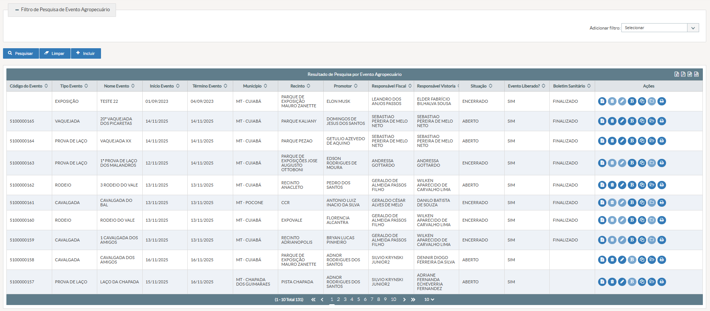

# US006 - Listar Eventos Agropecuários
#### STRY0087224 ok

## DESCRIÇÃO

**Título da Tela:** Pesquisa de Evento Agropecuário
**Caminho de navegação (breadcrumb):** Principal > Evento Agropecuário > Pesquisar

**EU COMO** servidor fiscal veterinário do INDEA
**DESEJO** pesquisar eventos agropecuários cadastrados no sistema com diversos critérios de filtro
**COM O OBJETIVO** de localizar rapidamente eventos específicos para visualização, alteração, exclusão ou geração de relatórios

## PROTÓTIPO DE TELA

*Figura 1: Modal de inclusão de espécie com campos para seleção de espécie, sexo, GTAs intraestaduais e interestaduais*

## 1. Critérios de Aceitação - Filtros de Pesquisa

### i) Seção "Filtro de Pesquisa de Evento Agropecuário"

#### Campo "Adicionar filtro"
- **Título**: Adicionar filtro
- **Tipo do Campo**: Seleção Única (Dropdown)
- **Opções**: Lista de campos disponíveis para filtro
- **Seleção**: Uma opção por vez
- **Estado Inicial**: Placeholder "Selecionar"
- **Preenchimento do Campo**: Opcional
- **Visibilidade**: Sempre visível
- **Lista de Valores Permitidos**: Código do Evento, Tipo Evento, Nome Evento, Início Evento, Término Evento, Município, Recinto, Promotor, Responsável Fiscal, Responsável Vistoria, Situação, Evento Liberado?, Boletim Sanitário
- **Validações Extras**: Ao selecionar uma opção, deve adicionar dinamicamente o campo correspondente na tabela de filtros abaixo

#### Tabela Dinâmica de Filtros
- **Tipo**: Tabela dinâmica
- **Estado Inicial**: Vazia
- **Preenchimento**: Condicionado à seleção no dropdown
- **Visibilidade**: Sempre visível, mostra campos quando adicionados
- **Funcionalidade**: Adiciona linha com campo selecionado e input correspondente

#### Opções de Filtro "Filtrar por"
- **Título**: Filtrar por
- **Tipo do Campo**: Seleção Única (Radio Button)
- **Opções**: "Todos os filtros", "Qualquer um deles"
- **Seleção**: Uma opção obrigatória
- **Estado Inicial**: "Todos os filtros" selecionado
- **Preenchimento do Campo**: Obrigatório
- **Visibilidade**: Sempre visível
- **Validações Extras**: Define se a pesquisa deve atender a todos os filtros (AND) ou qualquer um deles (OR)

## 2. Critérios de Aceitação - Botões de Ação

### i) Botão "Pesquisar"
- **Título**: Pesquisar
- **Tipo**: Botão de ação
- **Ícone**: Lupa (fa fa-search)
- **Estado Inicial**: Habilitado
- **Visibilidade**: Sempre visível
- **Classificação da Ação**: Ações Práticas
- **Ação realizada**: Executa a pesquisa com base nos filtros preenchidos
- **Destino da navegação**: Atualiza a tabela de resultados na mesma tela
- **Validações**: Mostra indicador de carregamento durante a pesquisa; Exibe mensagem se não encontrar resultados

### ii) Botão "Limpar"
- **Título**: Limpar
- **Tipo**: Botão de ação
- **Ícone**: Borracha (fa fa-eraser)
- **Estado Inicial**: Habilitado
- **Visibilidade**: Sempre visível
- **Classificação da Ação**: Link
- **Ação realizada**: Limpa todos os filtros preenchidos e a tabela de resultados
- **Destino da navegação**: Permanece na tela atual
- **Validações**: Reseta todos os campos para estado inicial; Limpa a tabela de resultados

### iii) Botão "Incluir"
- **Título**: Incluir
- **Tipo**: Botão de ação
- **Ícone**: Adicionar (fa fa-plus)
- **Estado Inicial**: Habilitado
- **Visibilidade**: Sempre visível
- **Classificação da Ação**: Link
- **Ação realizada**: Redireciona para tela de inclusão de evento agropecuário
- **Destino da navegação**: Tela "Incluir Evento Agropecuário"
- **Validações**: Verifica permissão do usuário para inclusão

## 3. Critérios de Aceitação - Tabela de Resultados

### i) Cabeçalho da Tabela
- **Título**: Resultado de Pesquisa por Evento Agropecuário
- **Colunas**: Código do Evento, Tipo Evento, Nome Evento, Início Evento, Término Evento, Município, Recinto, Promotor, Responsável Fiscal, Responsável Vistoria, Situação, Evento Liberado?, Boletim Sanitário, Ações
- **Funcionalidades**: Ordenação por coluna, redimensionamento de colunas

### ii) Barra de Exportação
- **Botão Exportar XLS**: Ícone Excel, exporta para formato XLS
- **Botão Exportar PDF**: Ícone PDF, exporta para formato PDF
- **Botão Exportar CSV**: Ícone texto, exporta para formato CSV
- **Botão Exportar XML**: Ícone código, exporta para formato XML
- **Visibilidade**: Sempre visível no cabeçalho
- **Validações**: Gera arquivo com todos os resultados da pesquisa, considerando paginação

### iii) Paginação
- **Estado Inicial**: Mostra primeiros 10 registros
- **Opções de linhas por página**: 10, 20, 50
- **Navegação**: Primeira, Anterior, Números de página, Próxima, Última
- **Contador**: Exibe range atual e total (ex: "1 - 10 Total 131")
- **Visibilidade**: Sempre visível quando há resultados

## 4. Critérios de Aceitação - Coluna Ações

### i) Botão "Visualizar"
- **Título**: Visualizar Evento Agropecuário
- **Ícone**: Arquivo de texto (fa fa-file-text)
- **Estado Inicial**: Habilitado para todos os registros
- **Visibilidade**: Sempre visível
- **Classificação da Ação**: Ação Apenas em Tela
- **Ação realizada**: Abre tela de visualização do evento em modo somente leitura
- **Destino da navegação**: Tela "Visualizar Evento Agropecuário"
- **Validações**: Verifica permissão de visualização

### ii) Botão "Excluir"
- **Título**: Excluir Evento Agropecuário
- **Ícone**: Lixeira (fa fa-trash)
- **Estado Inicial**: Condicional (habilitado/desabilitado conforme situação do evento)
- **Visibilidade**: Sempre visível
- **Classificação da Ação**: Ações Práticas
- **Ação realizada**: Exclui o evento agropecuário
- **Destino da navegação**: Modal de confirmação, depois atualiza tabela
- **Validações**: Disponível apenas para eventos com situação "ABERTO"; Solicita confirmação antes da exclusão

### iii) Botão "Alterar"
- **Título**: Alterar Evento Agropecuário
- **Ícone**: Lápis (fa fa-pencil)
- **Estado Inicial**: Condicional (habilitado/desabilitado conforme situação do evento)
- **Visibilidade**: Sempre visível
- **Classificação da Ação**: Link
- **Ação realizada**: Abre tela de alteração do evento
- **Destino da navegação**: Tela "Alterar Evento Agropecuário"
- **Validações**: Disponível apenas para eventos com situação "ABERTO"; Verifica permissão de alteração

### iv) Botão "Visualizar/Incluir Boletim Sanitário"
- **Título**: Visualizar/Incluir Boletim Sanitário
- **Ícone**: Negrito (fa fa-bold)
- **Estado Inicial**: Condicional (texto e ação variam conforme existência do boletim)
- **Visibilidade**: Sempre visível
- **Classificação da Ação**: Ação Apenas em Tela/Link
- **Ação realizada**: Visualiza boletim existente ou inclui novo boletim
- **Destino da navegação**: Tela correspondente ao boletim sanitário
- **Validações**: Se boletim existe: "Visualizar Boletim Sanitário"; Se não existe: "Incluir Boletim Sanitário" (desabilitado se evento não estiver liberado)
- **Regra de negócio**: O sistema deve passar a permitir que a funcionalidade de preenchimento do boletim sanitário do evento deva ficar disponível, para inclusão, também para servidor fiscal veterinário.

### v) Botão "Quantitativo de Animais"
- **Título**: Quantitativo de Animais no Evento
- **Ícone**: Múltiplos arquivos (fa fa-files-o)
- **Estado Inicial**: Habilitado para todos os registros
- **Visibilidade**: Sempre visível
- **Classificação da Ação**: Ações Práticas
- **Ação realizada**: Gera relatório de quantitativo de animais
- **Destino da navegação**: Gera PDF/impressão
- **Validações**: Abre em nova janela/modal

### vi) Botão "Encerrar"
- **Título**: Encerrar Evento Agropecuário
- **Ícone**: Pasta aberta/fechada (fa fa-folder-open-o / fa fa-folder-o)
- **Estado Inicial**: Condicional (ícone e estado variam conforme situação)
- **Visibilidade**: Sempre visível
- **Classificação da Ação**: Ações Práticas
- **Ação realizada**: Encerra ou reabre o evento
- **Destino da navegação**: Modal de confirmação, depois atualiza tabela
- **Validações**: Para eventos "ABERTO": mostra ícone de pasta aberta "Encerrar"; Para eventos "ENCERRADO": mostra ícone de pasta fechada "Reabrir" (se permitido)

### vii) Botão "Imprimir Autorização"
- **Título**: Imprimir Autorização
- **Ícone**: Impressora (fa fa-print)
- **Estado Inicial**: Habilitado para eventos liberados
- **Visibilidade**: Sempre visível
- **Classificação da Ação**: Ações Práticas
- **Ação realizada**: Gera documento de autorização do evento
- **Destino da navegação**: Gera PDF/impressão
- **Validações**: Disponível apenas para eventos com "Evento Liberado? = SIM"

## 5. Regras / Validações Complexas

### i) Lógica de Habilitção/Desabilitação de Ações
- **Eventos ABERTOS**: Permitir Alterar, Excluir, Encerrar
- **Eventos ENCERRADOS**: Desabilitar Alterar, Excluir; Permitir apenas Visualizar e relatórios
- **Eventos LIBERADOS**: Permitir impressão de autorização e boletim sanitário
- **Boletim Sanitário FINALIZADO**: Mostrar "Visualizar"; Caso contrário, mostrar "Incluir" (se evento liberado)

### ii) Paginação e Exportação
- A exportação deve considerar TODOS os resultados da pesquisa, não apenas a página atual
- A ordenação na exportação deve seguir a ordenação aplicada na tela
- O sistema deve manter os filtros aplicados durante a navegação entre páginas

### iii) Performance
- A pesquisa deve ser otimizada para grandes volumes de dados
- Deve implementar paginação server-side para melhor performance
- Os filtros devem usar índices apropriados no banco de dados

## 6. Observações

- A tabela de resultados deve ser responsiva e suportar rolagem horizontal quando necessário
- Deve haver feedback visual durante operações de carregamento
- As mensagens de "Sem registros" devem ser claras e orientar o usuário
- O sistema deve manter o estado dos filtros durante a sessão do usuário

## 7. Requisitos relacionados

- **RF-AC-003 – Acesso ao Boletim Sanitário:** O sistema deve passar a permitir que a funcionalidade de preenchimento do boletim sanitário do evento deva ficar disponível, para inclusão, também para servidor fiscal que seja veterinário.

- **Requisitos nas palavras do cliente**
 MÓDULO ANIMAL - Permitir que o servidor, CARGO FISCAL ESTADUAL DE DEFESA AGROPECUÁRIA E VETERINÁRIO, com situação ATIVO, possa preencher qualquer BOLETIM SANITÁRIO, atribuído a um EVENTO AGROPECUÁRIO.

