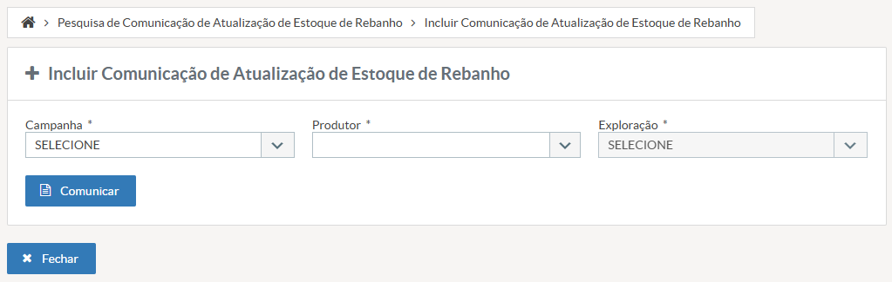

# US007 - Incluir Comunicação de Atualização de Estoque de Rebanho
#### STRY0087412 ok

## DESCRIÇÃO

**EU COMO** produtor rural ou servidor do INDEA
**QUERO** incluir uma comunicação de atualização de estoque de rebanho
**PARA QUE** eu possa atualizar o inventário pecuário do estabelecimento

## PROTÓTIPO DE TELA

*Figura 1: Tela de inclusão de comunicação de atualização de estoque de rebanho com campos para campanha, produtor e exploração*

## 1. Critérios de Aceitação - Campos

### i) Campanha
- **Tipo**: Dropdown
- **Obrigatório**: Sim
- **Estado**: Lista campanhas ativas
- **Validação**: Campanha deve estar ativa

### ii) Produtor
- **Tipo**: Autocomplete
- **Obrigatório**: Sim
- **Comportamento**: Ao selecionar, carrega explorações

### iii) Exploração
- **Tipo**: Dropdown
- **Obrigatório**: Sim
- **Estado**: Desabilitado até selecionar produtor

## 2. Critérios de Aceitação - Botões

### i) Comunicar
- **Ação**: Valida campos e inicia comunicação
- **Validações**:
  - Todos os campos obrigatórios preenchidos
  - **BLOQUEAR** se usuário for "produtor" E campanha estiver "Encerrada" ou "Inativa", o sistema não deve permitir a inclusão da comunicação, exibindo a mensagem: "Campanhas encerradas não aceitam novas comunicações".

### ii) Fechar
- **Ação**: Fecha tela sem salvar

## 3. Regras Gerais
- Comunicação bloqueia emissão de GTA até aprovação
- Sistema registra histórico e auditoria
- Validação de saldo disponível para movimentações

## 4. Requisitos considerados:
- **Bloquear** inclusão de Comunicação de Estoque para usuários "produtor" em campanhas com situação "Encerrada" ou "Inativa"
- **Bloquear** inclusão de Comunicação de Estoque para usuários "veterinario" em campanhas com situação "Encerrada" ou "Inativa"
- **Campanha de atualização de estoque** não permitir mais de uma comunicação por exploração por campanha.
