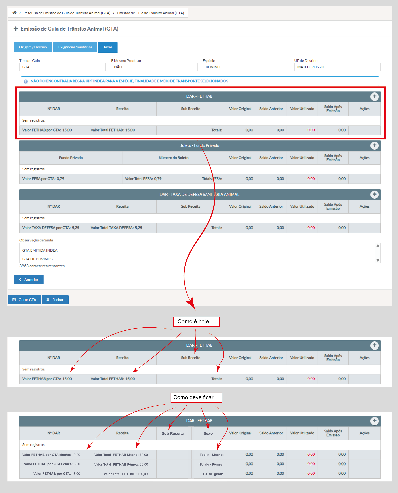

# US011 - Emitir Guia de Trânsito Animal (GTA) - Aba Taxas
#### STRY0087686 ok

## DESCRIÇÃO

**Título da Tela:** Emissão de Guia de Trânsito Animal (GTA) - Aba Taxas
**Caminho de navegação:** Pesquisa de Emissão de GTA > Emissão de GTA

**EU COMO** usuário do sistema INDEA (Produtor ou Veterinário) responsável pela emissão de GTAs
**QUERO** visualizar e gerenciar as taxas aplicáveis à emissão da Guia de Trânsito Animal com discriminação por sexo dos animais
**PARA QUE** eu possa controlar os valores de FETHAB, FESA e Taxa de Defesa Sanitária separados por macho e fêmea conforme as regras de fundos configuradas

## PROTÓTIPO DE TELA

*Figura 1: Aba Taxas da emissão de GTA com tabelas de DARs e boletos discriminados por sexo (macho/fêmea) conforme regras de fundos configuradas*

## CRITÉRIOS DE ACEITAÇÃO - Campos e estruturas da aba "Taxas"

### 1. Cabeçalho e Navegação
- Breadcrumb de navegação
- Wizard com 3 etapas: Origem/Destino, Exigências Sanitárias, Taxas
- Título da tela

### 2. Campos de Informação (Somente Leitura)
- **Tipo de Guia:** Campo somente leitura
- **É Mesmo Produtor:** Campo somente leitura  
- **Espécie:** Campo somente leitura
- **UF de Destino:** Campo somente leitura

### 3. Mensagem do Sistema
- Área para mensagens informativas do sistema
- Alertas de validação e regras de negócio

### 4. Tabela DAR - FETHAB
- Cabeçalho com botão "Adicionar"
- Colunas: Nº DAR, Receita, Sub Receita, Valor Original, Saldo Anterior, Valor Utilizado, Saldo Após Emissão, Ações
- Colunas para discriminação por sexo (Macho/Fêmea)
- Rodapé com totais e somatórios
- Estado inicial vazio

### 5. Tabela Boleto - Fundo Privado
- Cabeçalho com botão "Adicionar"
- Colunas: Fundo Privado, Número do Boleto, Valor Original, Saldo Anterior, Valor Utilizado, Saldo Após Emissão, Ações
- Colunas para discriminação por sexo (Macho/Fêmea)
- Rodapé com totais e somatórios
- Estado inicial vazio

### 6. Tabela DAR - Taxa de Defesa Sanitária Animal
- Cabeçalho com botão "Adicionar"
- Colunas: Nº DAR, Receita, Sub Receita, Valor Original, Saldo Anterior, Valor Utilizado, Saldo Após Emissão, Ações
- Colunas para discriminação por sexo (Macho/Fêmea)
- Rodapé com totais e somatórios
- Estado inicial vazio

### 7. Campo de Observação
- **Observação de Saída:** Textarea somente leitura
- Contador de caracteres restantes

### 8. Modal de Confirmação
- Título de confirmação
- Mensagem de confirmação para ações
- Botões de ação

### 9. Navegação do Wizard
- Botão "Anterior" para navegação reversa
- Botão "Próximo" para avanço no fluxo

## CRITÉRIOS DE ACEITAÇÃO

### Campos de Informação
- Todos os campos de informação devem ser somente leitura
- Valores devem ser herdados das abas anteriores do wizard
- Dados devem refletir as seleções feitas nas etapas prévias

### Gestão de DARs com Discriminação por Sexo
- Botão "Adicionar" deve abrir modal para inclusão de DAR
- Tabela deve exibir saldos, valores utilizados e saldos após emissão
- Grid deve conter colunas específicas para valores de Macho e Fêmea
- Somatórios devem ser calculados separadamente por sexo
- Aplicar discriminação apenas para Regras Fundos com sexo configurado

### Gestão de Boletos com Discriminação por Sexo
- Botão "Adicionar" deve abrir modal para inclusão de boleto
- Valores devem ser calculados automaticamente conforme regras
- Grid deve conter colunas específicas para valores de Macho e Fêmea
- Somatórios devem ser calculados separadamente por sexo

### Validações e Mensagens
- Sistema deve exibir mensagens quando regras não forem encontradas
- Totais devem ser calculados corretamente conforme configurações
- Observação deve respeitar limite máximo de caracteres
- Validação deve considerar configuração de sexo nas Regras Fundos

### Navegação no Wizard
- Wizard deve manter estado consistente entre todas as abas
- Botão "Anterior" deve retornar à aba de Exigências Sanitárias
- Modal de confirmação deve aparecer para ações destrutivas

### Perfis de Usuário
- Perfil Produtor deve visualizar grids com discriminação por sexo
- Perfil Veterinário deve visualizar grids com discriminação por sexo
- Funcionalidade idêntica para ambos os perfis de usuário

## REGRAS DE NEGÓCIO

### Valores e Cálculos
- Valores de taxas são definidos por espécie animal e UF de destino
- DARs e boletos devem possuir saldo suficiente para emissão da GTA
- Sistema deve validar compatibilidade entre espécie e regras UPF aplicáveis

### Discriminação por Sexo
- Para Regras Fundos com sexo configurado como Macho ou Fêmea:
  - Grid deve exibir colunas separadas para valores de Macho e Fêmea
  - Cálculos de somatório devem ser realizados separadamente por sexo
  - Valores totais devem refletir a soma discriminada por sexo
- Quando Regra Fundo não possui configuração de sexo, manter layout padrão sem discriminação

## REQUISITOS ESPECÍFICOS

### RF-TAXA-001 - Discriminação por Sexo nas Grids
O sistema deve apresentar nas grids de fundos/DAR da aba TAXAS a discriminação de valores por sexo (Macho/Fêmea) quando a Regra Fundo possuir em sua configuração a opção de sexo definida como Macho ou Fêmea.

### RF-TAXA-002 - Cálculos Separados por Sexo
Os somatórios totais das taxas devem ser calculados e exibidos separadamente para Macho e Fêmea, refletindo os valores específicos de cada sexo conforme configurado nas Regras Fundos.

### RF-TAXA-003 - Multiperfil
A funcionalidade de discriminação por sexo deve estar disponível tanto para usuários com perfil "Produtor" quanto "Veterinário", mantendo a mesma interface e cálculos.

---
## Requisitos Considerados (Texto Original)

- **6. Módulo Animal:** Na funcionalidade GTA, na aba TAXAS, a grid dos fundos ou DAR, devem ter valores de sexo e somatório do total das taxas separado por macho e fêmea para aquelas Regras Fundos que possuam em sua configuração a opção sexo configurada para macho ou fêmea.

- **7. Módulo Veterinário:** Na funcionalidade GTA, na aba TAXAS, a grid dos fundos ou DAR, devem ter valores de sexo e somatório do total das taxas separado por macho e fêmea para aquelas Regras Fundos que possuam em sua configuração a opção sexo configurada para macho ou fêmea.

- **14. Módulo Produtor:** Na funcionalidade GTA, na aba TAXAS, a grid dos fundos ou DAR, devem ter valores de sexo e somatório do total das taxas separado por macho e fêmea para aquelas Regras Fundos que possuam em sua configuração a opção sexo configurada para macho ou fêmea.

- **Observação:** Caso não haja regra de macho e fêmea no REGRAS FUNDOS, o sistema deve manter o comportamento já implementado, sem a discriminação por sexo.
